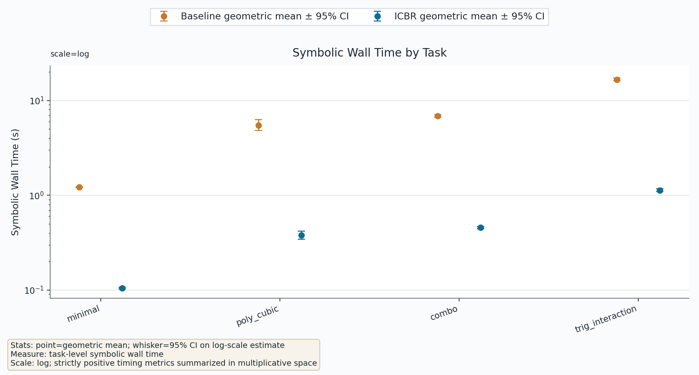
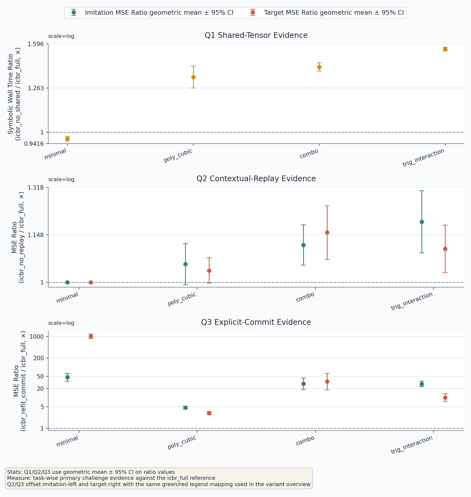
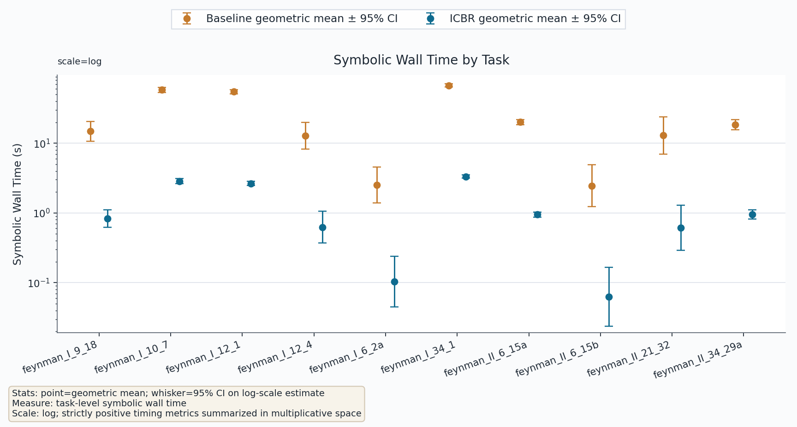
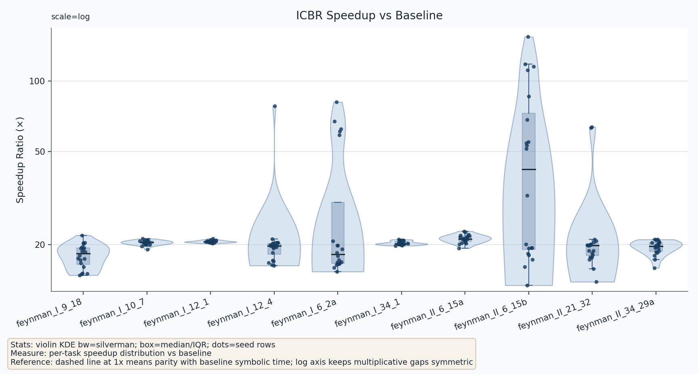
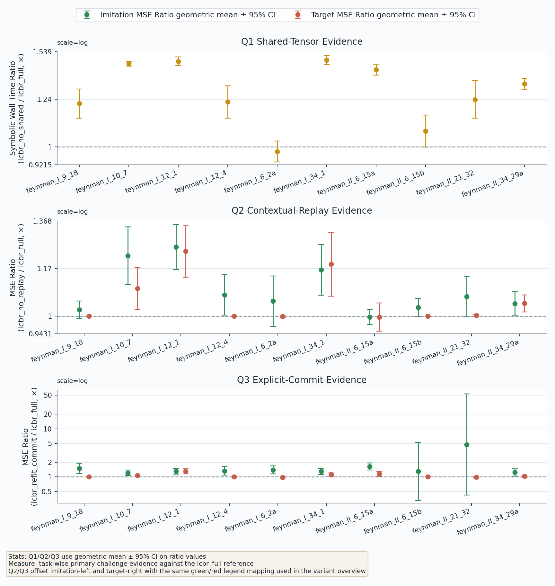

# ICBR-KAN Design

状态: Revised after Stage 24 and Stage 26 benchmark evidence  
日期: 2026-03-31  
范围: 设计一种替代当前逐边贪心符号拟合的后处理算法, 在**完全复用已经训练好的数值 KAN**前提下, 以尽量小的算法增量改进符号恢复质量与候选评估效率。

## 1. 摘要

本文将 ICBR-KAN 重新收缩为一个更稳健、更可实现的 Phase I 设计, 并以当前仓库中已经落地的 `kan/icbr.py`、`scripts/icbr_benchmark.py` 以及以下两轮 benchmark 结果作为校准依据:

- `outputs/icbr_benchmark_stage24_quality_4tasks_20seeds_all_variants/`
- `outputs/icbr_benchmark_feynman_reference_paper10_seeds1_20/`
- `outputs/icbr_benchmark_feynman_reference_paper10_seeds1_20_icbr_ablation/`

它严格满足以下边界:

- **训练阶段完全不改**
- **直接复用已训练完成的数值 KAN**
- **只改动符号拟合阶段**
- **不是新的训练器**
- **不是通用 symbolic regression**
- **不是程序搜索**
- **不是全局公式树发现**

相对当前 baseline `MultKAN.auto_symbolic()`，本文只保留两个核心改进点:

1. **shared-tensor symbolic candidate evaluation**  
   将 `suggest_symbolic()` 背后的逐边逐函数状态型试探，改写为对缓存 `(x_e, y_e)` 的无状态、按函数固定按边成批的候选评估。
2. **teacher-replay contextual reranking**  
   对每条边不再按局部 `R^2` 直接提交 top-1，而是在冻结教师 KAN 的上下文中用小校准集 replay 选择最终提交候选。

除此之外，第一版**明确不做**:

- block planning
- coupling graph
- active set
- affine polish
- 提交后再训练数值 KAN

换言之，本文不是把原方案扩张成一个复杂的 planning 系统，而是把它收紧为:

**更高效的候选生成 + 更正确的提交决策。**

基于当前 synthetic 与 Feynman 两轮结果，本文进一步固定四条论文写作口径:

1. 最稳健、最强的经验结论仍然是 **CPU 路线下的稳定大幅提速**，而不是“所有任务上都显著提高最终质量”。在已完成的 Feynman `10 tasks x 20 seeds` 主对比中，`199/199` 个有效配对样本的 `symbolic_wall_time_delta_s` 全部为正，baseline 与 `icbr_full` 的几何均值 symbolic wall time 分别约为 `16.07s` 与 `0.73s`，几何均值 speedup 约为 `21.93x`。
2. shared-tensor symbolic candidate evaluation 是当前最稳定的速度来源，但它的收益仍然具有任务依赖性。Feynman 消融中 `icbr_no_shared / icbr_full` 的 symbolic time 比值总体均值约为 `1.30`；在 `feynman_I_10_7`、`feynman_I_12_1`、`feynman_I_34_1` 上约为 `1.46x`、`1.48x`、`1.48x`，而在 `feynman_I_6_2a` 上仅约为 `0.98x`。
3. replay contextual reranking 的收益应表述为 **任务相关的质量稳定器**。Feynman 消融中平均 `replay_rank_inversion_rate` 约为 `0.39`，但显著收益主要集中在 `feynman_I_10_7`、`feynman_I_12_1`、`feynman_I_34_1` 等任务；在 `feynman_II_6_15a` 等任务上则仅观察到弱收益甚至轻微反向波动。
4. `formula_export_success` 只能表述为 **导出状态成功率**，不能表述为“真实公式恢复正确率”。更严格地说，variant-level 的 `baseline_formula_export_success` / `icbr_formula_export_success` 表示 `symbolic_formula()` 返回成功且导出公式条数与输出维度一致；paired `formula_export_success` 则要求 baseline 与 ICBR 两侧同时满足该条件。Feynman 主对比中所有有效 symbolic run 的 variant-level 导出状态均为 `100%`；唯一 `formula_export_success=0` 的配对样本来自 `feynman_I_12_1, seed=4` 的 teacher quality gate 拒绝，而不是符号拟合或导出链路失效。

## 2. 设计前提

### 2.1 控制变量原则

本设计遵循一个明确的实验原则:

**实验中完全复用已经训练好的数值 KAN。**

因此，所有对比实验都应在**相同的训练后数值模型**上运行:

- baseline 符号拟合器
- ICBR-KAN
- 两个核心改进点的消融

训练、剪枝、输入压缩如无特别说明均保持不变。

### 2.2 当前仓库中的真实任务

当前 `kan/` 中，符号恢复的真实工作流不是“重新从原始数据发现公式”，而是:

1. 先训练出数值 `MultKAN`;
2. 执行 forward，读取缓存的 `acts` 与 `spline_postacts`;
3. 对每条活跃边拟合一个单变量候选:

$$
\hat{\phi}_{l,j,i}(u)=c\,g(au+b)+d;
$$

4. 通过 `fix_symbolic()` 把该边从数值支路切到符号支路;
5. 最终由 `symbolic_formula()` 导出公式。

因此，ICBR-KAN 的真实任务是:

**给定一个已经训练好的数值 KAN，设计一个更优的 post-hoc symbolic fitting algorithm，以替代当前逐边局部贪心提交策略。**

### 2.3 第一版允许改什么，不改什么

允许改动:

- 候选生成方式
- 候选排序方式
- 最终提交决策方式
- replay 评估与诊断接口

不改动:

- 数值 KAN 的训练流程
- `KANLayer` / `FastKANLayer` 的数值表示
- spline / radial-bf 主体参数训练机制
- `symbolic_formula()` 的导出语义
- 已训练数值模型作为教师模型的身份

### 2.4 必须写清楚的实现事实

本文把以下三条视为**设计前提**，而不是实现细节:

1. `symbolic_formula()` 只读取 `symbolic_fun`，不读取数值支路。  
   因此，在导出前，每条有效边都必须有符号项。
2. `suggest_symbolic()` 当前会通过 `fix_symbolic()` / `unfix_symbolic()` 临时改模型状态。  
   因此候选生成与最终提交在当前实现中是耦合的。
3. `MultKAN.copy()` 当前是 checkpoint 式磁盘复制。  
   它不能直接作为高频 replay 内环 primitive。
4. `symbolic_formula()` 不把 `mask` 作为唯一真源。  
   因此，导出前不仅要 fully symbolic，还必须保证 `funs`、`funs_sympy`、`funs_avoid_singularity`、`funs_name`、`affine` 与 mask 处于一致状态，不能留下历史残留。

这三条分别决定了:

- 为什么第一版必须 fully symbolic 收口
- 为什么第一版必须重写候选生成
- 为什么第一版必须新增内存态 replay helper

## 3. KAN 理论与当前实现给出的直接约束

### 3.1 KAN 的核心结构

KAN 借用了 Kolmogorov-Arnold 表示中的“一元函数组合”思想，但当前 `kan/` 的真正实现结构是:

- 每条边对应一个一元函数响应;
- 多变量结构来自层级组合;
- 组合关系还会经过 `subnode_scale / subnode_bias / node_scale / node_bias` 与乘法节点传播。

因此，KAN 的 post-hoc symbolic fitting 既不是:

- 从零做公式树搜索

也不是:

- 完全逐边独立的局部替换

而是:

**在一个冻结的组合网络上，对边级一元函数做逐步符号替换。**

### 3.2 当前 `kan/` 中真正可直接复用的对象

对第 `l` 层边 `(i -> j)`，当前实现已经提供:

- 边输入缓存: `acts[l][:, i]`
- 边目标缓存: `spline_postacts[l][:, j, i]`
- 单边参数化: `c g(a x + b) + d`
- 符号写入口: `symbolic_fun[l]` 与 `fix_symbolic()`

其中最重要的是:

$$
x_e = \texttt{acts}[l][:, i],\qquad
y_e = \texttt{spline\_postacts}[l][:, j, i].
$$

需要加一条实现条件:

- `spline_postacts` 只有在**纯数值教师状态**下，才能直接被当作 teacher edge target
- `acts` 也只有在**纯数值教师 forward** 下采集时，才能与 `spline_postacts` 一起构成 teacher cache

这说明第一版最自然的算法重写点就在这里:

- 候选生成不必再经由 `suggest_symbolic()` 反复改状态;
- 可以直接把 `(x_e, y_e)` 当作 batched candidate evaluation 的输入。

### 3.3 为什么局部拟合分数不能直接等价于最终提交分数

当前单边拟合处理的是:

$$
\phi_e(u)\approx \hat{\phi}_e(u),
$$

但真正关心的是，在当前 work model 状态下替换该边之后:

$$
f_{\text{work+}e}(x)\approx f_{\text{teacher}}(x).
$$

两者之间隔着:

- 当前层的组合
- subnode affine
- node affine
- 下游 suffix

因此，单边局部 `R^2` 最多只能作为候选生成代理，而不应直接充当最终提交分数。

## 4. 当前 baseline 的真实语义

### 4.1 baseline 的代码路径

当前 `MultKAN.auto_symbolic()` 的关键路径是:

1. 遍历每条边;
2. 调用 `suggest_symbolic()`;
3. `suggest_symbolic()` 对函数库逐个调用 `fix_symbolic()` 做单边拟合;
4. 按复杂度与局部 `r2` 排序;
5. 由 `auto_symbolic()` 把 top-1 再次 `fix_symbolic()` 真正提交。

也就是说，baseline 的核心不是“全局搜索”，而是:

**逐边局部拟合 + 立即硬提交。**

### 4.2 baseline 的两个真实问题

当前 baseline 的结构性问题只有两个，而且都与当前 `kan/` 实现直接相关:

1. **候选生成是状态污染式的**  
   `suggest_symbolic()` 在枚举候选时会反复触碰模型内部 symbolic state。
2. **最终提交仍由局部拟合分数决定**  
   top-1 局部候选被直接提交，没有经过冻结教师上下文中的 replay 重排。

因此，相对 baseline 最稳健的改进也应只对应这两点，而不是一下子引入更多高风险机制。

### 4.3 `fit_params()` 的真实能力边界

当前 `kan.utils.fit_params()` 的真实语义是:

- 对 `(a,b)` 做有限网格扫描与缩窗搜索;
- 用相关性式 `r2` 作为局部排序代理;
- 在固定 `(a,b)` 后，用线性回归拟合 `(c,d)`;
- 对非法数值用 `nan_to_num` 兜底。

因此，本文只把它视为:

**candidate generator**

而不是:

**单边全局最优求解器**

## 5. ICBR-KAN 的重新定义

### 5.1 方法定义

本文将 ICBR-KAN 重新定义为:

**Imitation-Context Batched Reranking for KAN**

它是一个严格面向**冻结数值 KAN 后处理**的符号拟合器。

输入:

- 已训练好的数值 KAN

输出:

- fully symbolic KAN
- 或由 `symbolic_formula()` 导出的公式

### 5.2 仅保留的两个核心改进点

#### 改进点 1: Shared-Tensor Symbolic Candidate Evaluation

用缓存的 `(x_e, y_e)` 直接做无状态候选评估，替代 `suggest_symbolic()` 的状态式试探。

这一点的主要价值是:

- **工程与接口一致性**
- **状态去耦**
- **候选生成阶段的常数级提速空间**

根据当前 Stage 24 synthetic 结果与 Stage 26 Feynman 结果，这一改进的收益具有明显任务尺度效应:

- `minimal` 上 `icbr_no_shared / icbr_full` 的 symbolic wall time 比值约为 `0.97`，差异几乎可以忽略
- `poly_cubic`、`combo`、`trig_interaction` 上该比值分别约为 `1.38`、`1.41`、`1.55`
- 在 Feynman `10 tasks x 20 seeds` 消融中，该比值总体均值约为 `1.30`；其中 `feynman_I_10_7`、`feynman_I_12_1`、`feynman_I_34_1` 约为 `1.46x`、`1.48x`、`1.48x`
- Feynman 的边界情形同样存在：`feynman_I_6_2a` 上该比值约为 `0.98x`，说明在候选集较小、结构较简单时，shared batching 的优势可能接近于零

因此，对 shared-tensor candidate evaluation 更准确的表述应是:

**它不是对所有任务都同幅度生效的统一加速器，而是在候选评估负担较重的任务上提供更明显的常数级收益。**

#### 改进点 2: Teacher-Replay Contextual Reranking

对每条边的 shortlist，不再按局部 `R^2` 直接提交，而是在冻结教师上下文中用 replay imitation loss 选择最终提交候选。

这一点的主要价值是:

- **目标函数一致性**
- **最终提交分数与真实 post-hoc 目标更贴近**

但根据当前结果，replay 的经验收益需要用更克制的语言表述:

- `minimal` 上 `replay_rank_inversion_rate = 0`，`icbr_full` 与 `icbr_no_replay` 的质量几乎无差别
- `poly_cubic`、`combo`、`trig_interaction` 上 `replay_rank_inversion_rate` 均值约为 `0.55`、`0.34`、`0.53`
- 对应地，`icbr_full` 相对 `icbr_no_replay` 的 imitation / target 指标改进主要集中在这些非平凡任务上
- 在 Feynman 消融中，平均 `replay_rank_inversion_rate` 约为 `0.39`；其中 `feynman_I_10_7`、`feynman_I_12_1`、`feynman_I_34_1` 的 no-replay 相对 full 的 imitation MSE 退化分别约为 `6.87e-4`、`1.07e-1`、`2.74e-3`
- 但 `feynman_II_6_15a` 上 no-replay 相对 full 的 imitation / target MSE 反而分别约为 `-2.35e-5`、`-1.28e-4`，提示 replay 的经验收益并非由“存在 rank inversion”自动保证

因此，replay contextual reranking 在论文中应定位为:

**对上下文耦合更强任务有效的提交决策修正机制，而不是任何任务上都必然显著增益的万能模块。**

### 5.3 第一版明确不包含的内容

为控制实现风险，第一版不把以下内容作为方法核心:

- active set
- coupling score
- block planning
- pairwise synergy
- behavior-diverse shortlist
- affine-only polish

这些都可以作为后续扩展，但不应混入 Phase I 的主设计。

### 5.4 算法主线

ICBR-KAN 第一版的整体流程为:

1. Freeze teacher and collect teacher cache
2. Build edge shortlists by shared-tensor batched evaluation
3. For each edge, rerank shortlist by teacher replay
4. Commit best candidate
5. Continue until every effective edge has a symbolic assignment
6. Export by `symbolic_formula()`

这条流程的特征是:

- 候选生成和提交决策被拆开
- 最终决策引入冻结教师上下文
- 仍保持逐边、逐层、可控、易实现

## 6. 问题形式化

### 6.1 冻结教师模型与工作模型

设已经训练好的数值 KAN 记为:

$$
f_{\text{teacher}}.
$$

post-hoc 阶段中，我们显式区分两个对象:

1. **teacher model**  
   完全冻结，不做任何提交，只用于提供目标缓存和 replay 对照输出。
2. **work model**  
   从教师初始化，逐边提交符号候选，最终用于导出公式。

这是第一版必须写清楚的边界。  
否则“冻结教师边曲线”与“提交后 work state 已变化”会在定义上混淆。

### 6.2 边级候选参数化

对第 `l` 层边 `e=(l,j,i)`，设候选函数库为 `\mathcal{G}_l`。  
每个候选保持与当前 `kan/` 一致的参数化:

$$
\hat{\phi}_{e}(u)=c_e\,g_e(a_e u+b_e)+d_e.
$$

其中 `(a,b,c,d)` 与 `fit_params()` / `Symbolic_KANLayer.affine` 的语义一致。

### 6.3 teacher cache 与 work state 的职责划分

本文把每条边用到的数据分成两类:

1. **teacher cache**  
   来自冻结教师模型的 forward:
   - `x_e^{T}`
   - `y_e^{T}`
2. **work state**
   来自当前已部分符号化的 work model:
   - 当前已提交的 symbolic assignments
   - replay 时的整体输出

第一版固定如下使用规则:

- 候选生成只使用 `teacher cache`
- 最终提交分数只使用 `work state` 上的 replay imitation

### 6.4 与通用 symbolic regression 的区别

本文不是:

- 从原始样本直接生成全局公式树
- 重新学习整体函数

而是:

**对冻结 KAN 中的单边一元函数做候选生成，并在网络上下文中做最终提交决策。**

### 6.5 teacher imitation 与任务损失的桥接

当前 `kan/` 的默认训练损失是回归型 MSE。  
因此第一版理论桥接固定在这一设定。

定义:

$$
\mathcal{L}_{\text{imit}}^{\text{sq}}(f; f_{\text{teacher}})
=
\frac{1}{n}\sum_{t=1}^n
\|f(x_t)-f_{\text{teacher}}(x_t)\|_2^2.
$$

$$
\mathcal{L}_{\text{task}}^{\text{mse}}(f)
=
\frac{1}{n}\sum_{t=1}^n
\|f(x_t)-y_t\|_2^2.
$$

记教师残差为

$$
r_t=f_{\text{teacher}}(x_t)-y_t,
$$

工作模型扰动为

$$
d_t=f(x_t)-f_{\text{teacher}}(x_t).
$$

则

$$
\mathcal{L}_{\text{task}}^{\text{mse}}(f)
-\mathcal{L}_{\text{task}}^{\text{mse}}(f_{\text{teacher}})
=
\frac{1}{n}\sum_{t=1}^{n}
\left(2\langle r_t,d_t\rangle+\|d_t\|_2^2\right).
$$

若 $\|r_t\|_2 \le R$，则

$$
\left|
\mathcal{L}_{\text{task}}^{\text{mse}}(f)
-\mathcal{L}_{\text{task}}^{\text{mse}}(f_{\text{teacher}})
\right|
\le
2R\,\mathcal{L}_{\text{imit}}(f;f_{\text{teacher}})
+
\mathcal{L}_{\text{imit}}^{\text{sq}}(f;f_{\text{teacher}}).
$$

因此，在当前回归/MSE 设定下，用 imitation gap 做最终提交评分是有直接理论动机的。

### 6.6 第一版的逐边决策目标

第一版不做联合 block 规划，而是对当前 work state 下的每条边 `e` 做 shortlist 重排。

设 `\mathcal{S}_e` 为边 `e` 的候选集合。  
对任一候选 `z \in \mathcal{S}_e`，记把它临时写入当前 work model 后得到的模型为 `f_{\text{work}}^{(e \leftarrow z)}`。

第一版的最终提交分数定义为:

$$
\mathcal{J}_e(z)=
\mathcal{L}_{\text{imit}}^{\text{sq}}
\big(
f_{\text{work}}^{(e \leftarrow z)};
f_{\text{teacher}}
\big)
+
\lambda_c\,\mathcal{C}(z).
$$

然后提交

$$
z_e^\star=\arg\min_{z\in\mathcal{S}_e}\mathcal{J}_e(z).
$$

这就是第一版的核心决策规则。

## 7. ICBR-KAN 的关键设计

### 7.1 Freeze Teacher and Collect Teacher Cache

在符号拟合开始前，先固定一个**纯数值教师模型**并收集:

- `teacher_acts[l][:, i]`
- `teacher_edge_targets[l][:, j, i]`
- 小校准集上的教师输出

这里必须强调:

- 这些 cache 来自教师模型，而不是后续逐步变化的 work model
- cache 一旦收集完成，第一版候选生成阶段不再刷新它们

更具体地说，若教师仍是纯数值 KAN，则可以直接复用当前 `forward()` 中在该状态下得到的:

- `acts`
- `spline_postacts`

作为 `teacher cache` 的底座。  
若教师模型中已有 symbolic branch 打开，则不能直接把当前 `spline_postacts` 当成纯 teacher edge target，必须先回到纯数值教师状态再收集 cache。

### 7.2 Shared-Tensor Symbolic Candidate Evaluation

这是第一核心改进点，也是你特别强调应保留的部分。

对每条边 `e=(l,j,i)`，从 teacher cache 取:

$$
x_e = \texttt{teacher\_acts}[l][:, i],\qquad
y_e = \texttt{teacher\_edge\_targets}[l][:, j, i].
$$

随后不再走 `suggest_symbolic()` 的状态型循环，而是对固定函数族 `g` 做同层批量候选评估。

在当前 KAN 后处理场景中，真正可共享的不是公式树搜索中的 DAG 子式，而是:

- 同层所有边的输入缓存 `x_e`
- 同层所有边的目标缓存 `y_e`
- 固定函数族共享的仿射搜索网格 `(a,b)`
- 中间张量 `u = a x + b`
- 批量相关性、均值、方差等排序统计量

因此，更准确的表述不是抽象的“并行 symbolic enumeration”，而是:

**shared-tensor symbolic candidate evaluation for KAN edges**

它的直接收益是:

- 消除 `suggest_symbolic()` 的状态污染
- 候选生成与最终提交解耦
- 为批处理和缓存复用提供空间
- 在不改变问题定义的前提下争取常数级速度收益

需要明确:

- 这不是主阶复杂度改进
- 它首先是计算重组与状态去耦
- 常数级收益来自共享 tensor 与减少无谓状态写入

### 7.3 Simple Shortlist Instead of Rich Heuristics

为控制实现风险，第一版 shortlist 不做复杂的“行为多样性标签工程”。

对每条边，只保留一个简单 shortlist:

- 局部拟合分数高的若干候选
- 同时保留函数族复杂度信息
- 记录必要的拟合诊断

第一版建议保留的诊断量只有:

- `boundary_hit`
- `nan_to_num_trigger`
- `top1_top2_margin`

这样做的目的是:

- 保留足够的候选可供 replay 重排
- 不把大量启发式塞进第一版核心方法

### 7.4 Teacher-Replay Contextual Reranking

这是第二核心改进点。

对每条边 `e` 的 shortlist `\mathcal{S}_e`，第一版不再根据局部 `R^2` 直接提交 top-1，而是:

1. 在当前 work model 状态下，临时写入候选 `z`
2. 在小校准集上完整 forward
3. 与冻结教师输出比较 imitation gap
4. 按 `\mathcal{J}_e(z)` 选最终候选

这一步的关键意义是:

- 局部 `R^2` 只看边曲线
- replay imitation 直接看“当前网络上下文中的真实提交后果”

因此，这里的“contextual”不是通用 planning，而是一个更收紧的概念:

**single-edge contextual reranking inside a frozen KAN**

### 7.5 提交顺序保持简单

为了控制变量，第一版不额外发明复杂的选边策略。

建议直接沿用当前 `auto_symbolic()` 的基本外层顺序:

- 逐层
- 层内逐输入、逐输出

新的内容只发生在:

- 如何生成 shortlist
- 如何在 shortlist 内做最终重排

而不发生在:

- 重新设计全局选边顺序

### 7.6 Fully Symbolic Completion 是接口约束，不是可选功能

由于 `symbolic_formula()` 只读取 `symbolic_fun`，所以第一版必须保证:

- 每条有效边最终都写入一个符号候选
- 被剪掉的边显式写为 `0`

这里不能把“fully symbolic 收口”写成附加美观目标。  
它是 exporter correctness 的硬约束。

### 7.7 第一版明确不做的事情

以下内容全部移出第一版主方法:

- edge active set
- pairwise coupling
- block 决策
- block replay
- 提交后 affine polish
- node/subnode affine 优化

这样做的理由不是这些想法没价值，而是:

- 它们超出了“相对 baseline 的适量改进”
- 它们会显著提高实现与调参不稳定性
- 它们并不是取得第一轮有效提升的必要条件

## 8. 算法伪代码

### 8.1 Algorithm 1: Batched Candidate Generation

```python
def build_edge_shortlist_batched(edge_packets, layer_lib, cfg):
    shortlists = {}
    diagnostics = {}

    for fun_name in layer_lib:
        batch_result = batched_symbolic_candidates(
            edge_packets=edge_packets,
            fun_name=fun_name,
            a_range=cfg.a_range,
            b_range=cfg.b_range,
        )

        for edge, result in batch_result.items():
            shortlists.setdefault(edge, []).append(
                Candidate(
                    fun_name=fun_name,
                    params=result.params,
                    local_score=result.local_score,
                    complexity=result.complexity,
                )
            )
            diagnostics.setdefault(edge, []).append(
                CandidateDiagnostic(
                    fun_name=fun_name,
                    boundary_hit=result.boundary_hit,
                    nan_to_num_trigger=result.nan_to_num_trigger,
                )
            )

    for edge in shortlists:
        shortlists[edge] = keep_topk_by_local_score(
            shortlists[edge],
            k=cfg.shortlist_size,
        )

    return shortlists, diagnostics
```

### 8.2 Algorithm 2: Teacher-Replay Contextual Reranking

```python
def rerank_edge_by_teacher_replay(work, teacher, calib, edge, shortlist, cfg):
    best = None
    best_obj = float("inf")

    for cand in shortlist:
        replay_loss = evaluate_edge_candidate_by_replay(
            work=work,
            teacher=teacher,
            calib=calib,
            edge=edge,
            candidate=cand,
        )
        obj = replay_loss + cfg.lambda_c * cand.complexity
        if obj < best_obj:
            best_obj = obj
            best = cand

    return best, best_obj
```

### 8.3 Algorithm 3: Full ICBR-KAN Procedure

```python
def auto_symbolic_icbr(teacher, dataset, cfg):
    teacher_cache = collect_teacher_cache(teacher, dataset, cfg)
    work = clone_numeric_teacher_as_work_model(teacher, cfg)

    for layer_idx in range(work.depth):
        edge_packets = build_layer_edge_packets(teacher_cache, layer_idx, cfg)
        layer_lib = resolve_layer_library(layer_idx, work.depth, cfg)
        shortlists, diagnostics = build_edge_shortlist_batched(
            edge_packets, layer_lib, cfg
        )

        for edge in iterate_edges_in_baseline_order(work, layer_idx):
            best, score = rerank_edge_by_teacher_replay(
                work=work,
                teacher=teacher,
                calib=dataset["calibration"],
                edge=edge,
                shortlist=shortlists[edge],
                cfg=cfg,
            )
            commit_symbolic_candidate(work, edge, best)

    return finalize_symbolic_report(work, teacher_cache, cfg)
```

## 9. 理论分析

### 9.1 基本假设

第一版只依赖以下假设:

**假设 A1: 教师充分性**  
冻结数值 KAN 已位于可接受性能区间，因此 post-hoc 阶段的目标是逼近教师而不是重新学习任务。

**假设 A2: suffix 局部正则性**  
当前 work state 附近的下游组合映射在工作域上局部稳定。

**假设 A3: 校准子集代表性**  
小校准集上的 replay 排序能近似整体数据上的 imitation 风险排序。

需要提前说明的是，两个核心改进点的理论地位并不相同:

- 改进点 1 主要解决计算组织与接口语义问题
- 改进点 2 主要解决最终提交分数与目标错配问题

### 9.2 定理 1: 在当前回归/MSE 设定下，teacher imitation 控制任务损失偏移

沿用第 6.5 节定义。若教师残差满足 `\|r_t\|_2 \le R`，则

$$
\left|
\mathcal{L}_{\text{task}}^{\text{mse}}(f)
-\mathcal{L}_{\text{task}}^{\text{mse}}(f_{\text{teacher}})
\right|
\le
2R\sqrt{\mathcal{L}_{\text{imit}}^{\text{sq}}(f;f_{\text{teacher}})}
\mathcal{L}_{\text{imit}}^{\text{sq}}(f;f_{\text{teacher}}).
$$

因此，在当前 `kan/` 的默认回归场景中，最终提交分数以 imitation gap 为主是合理的。

### 9.3 命题 2: 局部 `R^2` 不是最终提交分数

对同一条边的两个候选 `z_1, z_2`，即便它们在 teacher cache 上的局部 `R^2` 排名满足

$$
R^2(z_1) > R^2(z_2),
$$

也不能推出在当前 work state 下有

$$
\mathcal{J}_e(z_1) < \mathcal{J}_e(z_2).
$$

原因是 `R^2` 只评估边曲线拟合，而 `\mathcal{J}_e(z)` 评估的是当前网络上下文中的整体 imitation 偏移。

因此:

- `R^2` 适合作为候选生成代理
- replay imitation 才适合作为最终提交分数

### 9.4 命题 3: shared-tensor candidate evaluation 是计算重组，不是问题重定义

对固定层与固定函数族 `g`，若使用同一组 `(x_e, y_e)`、同一参数化 `c g(a x+b)+d` 与同一局部打分规则，则:

- 逐边逐函数串行评估
- 按函数固定、按边成批的 batched 评估

在数学目标上等价，区别只在于计算组织方式。

因此，改写为 shared-tensor batched evaluation:

- 不会改变候选空间
- 不会改变每个候选的定义
- 只是在工程上减少状态污染并争取常数级收益

这正是第一核心改进点的理论与实现边界。

### 9.5 理论上必须被实验验证的断言

第一版需要实验验证的断言只有三个:

1. imitation gap 与最终 dataset-target loss shift 在当前任务族上保持可解释联系
2. contextual rerank 的收益主要应体现在存在非平凡 rank inversion 的任务上，而不是被假设为对所有任务一律有效
3. shared-tensor candidate evaluation 能在非平凡任务上带来稳定的常数级时间收益

## 10. 复杂度分析

记:

- `E` 为有效边数
- `F` 为函数库大小
- `K` 为每边 shortlist 大小
- `C_fit` 为单边 `fit_params` 成本
- `C_replay` 为一次 replay evaluator cycle 成本
- `C_commit` 为一次提交成本

### 10.1 baseline 复杂度

当前 baseline 的主要成本可写成:

$$
T_{\text{base}}
=
O(E F C_{\text{fit}} + E C_{\text{commit}}).
$$

其中 `E F C_fit` 对应候选拟合，`E C_commit` 对应最终 top-1 提交。

### 10.2 ICBR-KAN Phase I 复杂度

第一版 ICBR-KAN 的总成本为:

$$
T_{\text{ICBR}}
=
T_{\text{cand}}
+
T_{\text{rerank}}
+
T_{\text{commit}}.
$$

其中:

#### A. 候选生成

$$
T_{\text{cand}}=O(E F C_{\text{fit}}).
$$

主阶与 baseline 相同。  
但 shared-tensor evaluation 带来的是:

- 更少的状态写入
- 更高的缓存复用
- 更强的按函数批处理能力
- 在保留当前 `sklearn.LinearRegression` 路径时，收益主要来自前半段共享计算与状态去耦，而不是完整意义上的批量闭式求解

因此，这里的主张应明确写成:

**常数级改进，而不是主阶下降。**

#### B. 单边 contextual rerank

每条边对 `K` 个 shortlist 候选做 replay:

$$
T_{\text{rerank}}=O(E K C_{\text{replay}}).
$$

#### C. 最终提交

每条边提交一次:

$$
T_{\text{commit}}=O(E C_{\text{commit}}).
$$

### 10.3 为什么这是合理的复杂度分配

第一版新增成本只花在真正更接近目标的地方:

- 候选生成阶段做更干净的批量评估
- 决策阶段用 replay 做最终重排

而没有把预算投入到:

- block 规划
- 全网重训
- 高维交互搜索

这符合本文“适量有效提升”的设计原则。

### 10.4 11.3 所强调的常数级收益应如何表述

这部分需要特别保留并写清楚:

共享的不是公式树中的“中间表达式”，而是:

- 同层所有边的 `x_e`
- 同层所有边的 `y_e`
- 固定函数族共享的 `(a,b)` 网格
- 中间张量 `u = a x + b`
- 批量相关性/方差统计量

因此，第一版复杂度收益不应写成“并行枚举改变大 O”，而应写成:

**通过 shared-tensor symbolic candidate evaluation 降低候选生成的常数项。**

### 10.5 第一版的硬件口径: 只实现 CPU 路线

第一版明确固定为 **CPU-first implementation**。  
也就是说，Phase I 只承诺实现 CPU 路线，不把 CUDA 作为交付目标。

更重要的是，这种选择不是保守退让，而是因为当前 `kan/` 的 post-hoc symbolic fitting 结构，本来就更吻合 CPU 路线的稳健优化。

#### A. 为什么第一版应实现 CPU 路线

在当前保留 `fit_params()` + `sklearn.LinearRegression` 的前提下，CPU 路径最现实的收益来源是:

- 减少 `suggest_symbolic()` 带来的 state mutation
- 减少 `fix_symbolic()` / `unfix_symbolic()` 的重复写入
- 共享 `(a,b)` 搜索网格
- 共享 `u = a x + b` 与相关统计量
- 按函数固定、按边成批，减少 Python 循环与对象调度开销

因此，CPU 路径的第一目标应写成:

**降低 Python 调度、状态写入和重复张量计算的常数项。**

这与当前 KAN 的吻合点在于:

- 当前 symbolic fitting 的基本单位本来就是**单边一元函数**
- `suggest_symbolic()` 的主要低效本来就来自**状态试写**而不是大矩阵训练
- `SYMBOLIC_LIB` 是异构函数库，很多开销来自 Python 层枚举与对象管理
- replay、commit、export 都带有明显的控制流与对象状态语义，而不是纯张量大算子

因此，对当前 KAN 而言，CPU 路径不是“退而求其次”，而是更贴合第一版问题结构的默认实现方向。

#### B. 为什么第一版不实现 CUDA 路线

若后续将候选生成更多留在 torch 侧，并把 `(c,d)` 拟合改为 torch 内闭式批量求解，则 CUDA 路径的主要收益来源会变成:

- 同层多边共享大张量计算
- 固定函数族下的大批量 `u = a x + b` 与 `g(u)` 评估
- 批量均值、方差、相关性统计
- 减少 CPU/GPU 往返

若未来进入 Phase II，CUDA 路径的目标才应写成:

**把候选生成链尽量保持在同一设备上，利用大张量批处理放大 shared-tensor 评估收益。**

但这里必须明确它与 KAN 的**部分吻合、部分不吻合**:

吻合的部分:

- KAN 的边缓存天然提供了同层多边的 `x_e / y_e`
- 对固定函数族 `g`，`u = a x + b` 与 `g(u)` 的评估可以写成同构大张量计算
- 若层宽较大、候选库较大，teacher-cache candidate generation 确实可能从 GPU 批处理获益

不吻合的部分:

- 当前函数库是**异构**的，不是单一算子族
- replay contextual rerank 需要频繁做**候选写入 / 回滚 / 整网 forward**，这不是最典型的 GPU 优势场景
- `symbolic_formula()`、`sympy`、以及当前 `sklearn.LinearRegression` 路径都不在 CUDA 友好主链上
- 第一版若模型较小、层宽较窄，GPU 往返与 kernel launch 常数项可能吞掉收益

因此，CUDA 优化只应被视为**候选生成子阶段**的潜在放大器，而不应被写成整个 ICBR-KAN Phase I 的默认实现路线。

#### C. 第一版的硬件承诺

第一版的硬件承诺直接写死为:

- **只实现 CPU 路线**
- **不以 CUDA 加速作为 Phase I 验收条件**
- **所有复杂度与 wall time 报告默认按 CPU 路线解释**

这样做的理由是:

- 与当前 `fit_params()` 的真实实现一致
- 与当前 KAN 的控制流型 symbolic fitting 结构一致
- 更容易把收益归因到算法本身，而不是设备差异

### 10.6 这些硬件优化为什么与当前 KAN 场景吻合

为了避免把一般硬件优化叙事硬套到 KAN 上，本文把“吻合”明确限定为以下三点:

1. **是否顺着 KAN 的边级一元函数结构发力**  
   shared-tensor candidate evaluation 直接围绕 `x_e -> y_e` 展开，因此与当前 KAN 的边函数结构吻合。
2. **是否顺着当前 `kan/` 的真实瓶颈发力**  
   当前 baseline 的主要额外开销来自 `suggest_symbolic()` 的状态污染与逐边枚举，而不是大规模参数训练；因此 CPU-first 的状态去耦与共享计算是吻合的。
3. **是否不破坏 post-hoc symbolic fitting 的边界**  
   若某种“优化”实质上要求重写训练器、改写模型主体或引入全网重训练，那它就不再吻合本文的 KAN 问题设定。

据此，本文对两类优化的最终判断是:

- **CPU 改进**: 与当前 KAN Phase I 高度吻合，且是第一版唯一实现目标
- **CUDA 改进**: 只与 candidate generation 子问题局部吻合，保留为 Phase II 可选扩展

## 11. 与相关方法的关系

### 11.1 来自 KAN 本身的启发

KAN 的核心启发是:

- 一元函数在边上
- 高维结构由层级组合形成

这直接支持本文的基本立场:

**post-hoc symbolic fitting 的自然单位是边函数，而不是全局公式树。**

### 11.2 关于“生成/决策分离”的内部设计原则

这一节不必再挂到一般 symbolic regression 框架上。

在当前 `kan/` 场景中，更准确的表述就是:

**候选生成与最终提交应分离。**

也就是说:

- `suggest_symbolic()` 不应继续同时承担“生成候选”和“诱导最终提交”的双重角色
- 局部 top-1 只能进入 shortlist
- 最终提交应由 replay contextual score 决定

### 11.3 来自并行枚举与共享评估的启发

这一节应被保留，而且应被提升为第一核心改进点的直接方法学来源。

从当前 `kan/` 的实现组织来看，`suggest_symbolic()` 的最大低效并不在函数库本身，而在它不能共享同层候选评估中的中间张量。

与之同向的是，近期并行 symbolic enumeration 强调:

- 共享中间表达式
- 批量评估候选
- 将生成与评估解耦

ICBR-KAN 在当前 `kan/` 里的对应落点是:

- 直接在缓存的 `(x_e, y_e)` 上做纯函数式候选评估
- 避开 `suggest_symbolic()` 的状态污染
- 把“逐边逐函数的状态型搜索”改写成“按函数固定、按边成批的无状态评估”
- 为批处理、缓存和后续并行保留可能性

这里还应写得更尖锐一点:

- `suggest_symbolic()` 不是只“建议”，而是通过**试写 symbolic state**来完成候选评估
- 因此 shared-tensor candidate evaluation 改写的是候选生成的组织方式，而不是最终决策目标

这里必须把“共享中间表达式”改写为更符合 `kan/` 现实的表述。  
在当前 KAN 后处理场景中，真正可共享的不是公式树搜索里的 DAG 子式，而是:

- 同层所有边的输入缓存 `x_e`
- 同层所有边的目标缓存 `y_e`
- 对固定函数族共享的仿射搜索网格 `(a,b)`
- 中间张量 `u = a x + b`
- 批量相关性/方差等排序统计量

因此，第一版更精确的表述应是:

**shared-tensor symbolic candidate evaluation for KAN edges**

而不是泛泛地说“并行 symbolic enumeration”。

这一节在第一版中的地位不是外围包装，而是:

**候选生成阶段的直接工程与方法学核心。**  
但也必须明确: 这里的核心更多是工程半边，而不是新的理论目标。

### 11.4 关于局部上下文决策的设计原则

第二核心改进点同样不需要借助抽象 planning 话语。

在当前 `kan/` 场景中，更贴切的事实是:

**我们不需要通用 lookahead，也不需要 block 规划；只需要把每条边的最终提交分数从局部 `R^2` 换成冻结教师上下文中的 replay imitation。**

这就是第一版 contextual reranking 的全部含义。

## 12. 与当前 `kan/` 实现的接口对接

### 12.1 推荐集成位置

建议新增:

- `kan/icbr.py`
- `auto_symbolic_icbr(...)`

也可在 `MultKAN` 上增加 opt-in 入口:

- `MultKAN.auto_symbolic_icbr(...)`

### 12.2 保持不变的本体行为

以下部分保持不变:

- `MultKAN` 的训练行为
- `MultKAN.forward()` 的缓存契约
- `symbolic_formula()` 导出语义
- 数值模型作为冻结教师模型的身份

### 12.3 直接复用的现有对象

ICBR-KAN 直接复用:

- `acts`
- `spline_postacts`（仅在纯数值教师状态下作为 teacher cache）
- `spline_postsplines`（若后续实现需要进一步逼近 numeric-only response，可作为辅助检查对象）
- `SYMBOLIC_LIB`
- `Symbolic_KANLayer.affine`
- `fit_params()`

### 12.4 第一版真正需要新增的 helper

截至 Stage 24，第一版已经在 `kan/icbr.py` 中落地为一组明确的 helper/entry 组合。设计稿中的抽象 helper 与实际实现对应关系如下。

#### Helper 1: `generate_layer_candidates(...)` 与 `_build_layer_shortlists_shared(...)`

对应设计中的 batched candidate generation，最小语义是:

1. 输入同层一批边的 `(x_e, y_e)`
2. 对固定函数族共享 `(a,b)` 网格与中间张量
3. 返回每条边的候选参数、局部分数与诊断量
4. 不触碰模型 symbolic state

Stage 22 之后，实际实现还加入了两条重要约束:

- 只对当前仍为 numeric-active 的 edge 生成候选
- per-edge shortlist 采用固定容量 `top-k` 聚合，而不是长期保留全量候选

#### Helper 2: `replay_rerank_edge_candidates(...)`

对应设计中的 replay evaluator，最小语义是:

1. 保存目标边的 `funs` / `funs_sympy` / `funs_avoid_singularity` / `funs_name` / `affine` / numeric mask / symbolic mask
2. 在当前 work model 上临时写入某个边候选
3. 在校准集上执行完整 forward
4. 与冻结教师输出比较 imitation gap
5. 逐项恢复上述状态

其底层依赖 `_snapshot_symbolic_edge_state(...)`、`_apply_symbolic_candidate_state(...)`、`_restore_symbolic_edge_state(...)` 三个内存态 primitive。

这里必须是**内存态 snapshot/apply/restore**，不能直接反复调用当前磁盘式 `copy()`。
并且 replay 内环必须完全绕开 `log_history/auto_save` 机制，不能借用会触发落盘的现有 API 作为实现路径。

#### Helper 3: `commit_symbolic_candidate(...)`

最小语义:

1. 注册 `funs` / `funs_sympy` / `funs_avoid_singularity` / `funs_name`
2. 直接写入外部候选 affine
3. 切换 numeric / symbolic mask

之所以必须有这个 helper，是因为当前 `fix_symbolic()` 默认会重新拟合或用默认参数初始化，而不是“提交外部已选候选”。
同时，这个 helper 必须维护 symbolic state 的内部一致性，保证后续 `symbolic_formula()` 不会读到历史残留。

#### Helper 4: `auto_symbolic_icbr(...)`、`benchmark_symbolic_variants(...)` 与 `benchmark_icbr_vs_baseline(...)`

这三个 entry 不是新的算法原语，但已经成为当前论文复现实验的实际承载接口:

1. `auto_symbolic_icbr(...)` 负责 ICBR 主流程
2. `benchmark_symbolic_variants(...)` 负责 baseline / `icbr_full` / `icbr_no_replay` / `icbr_no_shared` / `icbr_refit_commit` 的统一评估
3. `benchmark_icbr_vs_baseline(...)` 负责主表与报告所需的对照聚合

因此，后续论文文字若讨论“当前实现”，应优先引用这些真实 entry，而不是仅停留在抽象 helper 名称上。

### 12.5 第一版明确不需要的 helper

由于我们已把方法收缩为两个核心改进点，因此第一版不再需要:

- active set helper
- pairwise synergy helper
- block planner
- affine subset optimizer

这能显著降低实现风险。

## 13. 实验设计

### 13.1 对照原则

实验中始终使用**同一批已经训练好的数值 KAN**。  
只替换 `kan/` 层的符号拟合器。

正式主对照仍然是:

1. baseline `MultKAN.auto_symbolic()`
2. `icbr_full`

但从论文证据链角度，当前仓库的标准实验矩阵已经扩展为五个变体:

1. `baseline`
2. `icbr_full`
3. `icbr_no_replay`
4. `icbr_no_shared`
5. `icbr_refit_commit`

其中后 3 个不是新的竞争方法，而是为了分别隔离:

- shared candidate evaluation 的时间贡献
- replay rerank 的质量贡献
- explicit commit 相对 re-fit commit 的必要性

### 13.2 主要验证问题

第一版只回答四个问题:

1. 在相同数值 KAN 上，ICBR-KAN 是否在 CPU 路线上稳定加速?
2. contextual rerank 是否在存在非平凡上下文耦合的任务上优于局部 `R^2` 直接提交?
3. shared-tensor candidate evaluation 是否带来稳定的常数级时间收益?
4. explicit commit 是否相对 re-fit commit 避免了额外参数漂移与质量退化?

### 13.3 实验条件与数据切分

当前已完成的 Stage 24 复测使用如下实验条件:

- 操作系统：Windows 11 专业版 `23H2`（OS Build `22631.5472`）
- Python：`Miniconda` 的 `kan` 环境，解释器路径  
  `C:\Users\chenpeng\miniconda3\envs\kan\python.exe`
- Python 版本：`3.9.25`
- CPU：`12th Gen Intel(R) Core(TM) i5-12500H`
- 内存：`16 GB`
- 深度学习运行时：`PyTorch 2.1.2+cpu`
- 硬件执行口径：本轮复测全部按 **CPU 路线** 执行

上述环境信息的作用不是渲染“高算力”条件，而是固定本文当前结果的复现实验边界。  
特别是，Phase I 的速度结论应被理解为 **在该 CPU-first 条件下** 相对 baseline 的比较结果。

除非另有说明，实验默认沿用 `pykan` 的 `SYMBOLIC_LIB` 作为候选符号函数库；其对应候选函数名可概括为：`x, x^2, x^3, x^4, x^5, 1/x, 1/x^2, 1/x^3, 1/x^4, 1/x^5, sqrt, x^0.5, x^1.5, 1/sqrt(x), 1/x^0.5, exp, log, abs, sin, cos, tan, tanh, sgn, arcsin, arccos, arctan, arctanh, 0, gaussian`。

在此条件下，benchmark 数据流固定拆成 `train / calibration / test` 三段，且三者互不重叠。

1. **train split**  
   仅用于训练数值教师 KAN
2. **calibration split**  
   仅用于 symbolic fitting、replay contextual rerank 与 commit 后的中间评估
3. **test split**  
   仅用于最终报告指标

当前默认口径固定为:

- synthetic quality tasks: `1000 / 500 / 500`
- Feynman quality tasks: `2000 / 1000 / 1000`
- 一般比例记作 `2:1:1`

这里必须特别强调:

- `imitation_*` 指标的参照物是冻结教师输出
- `target_*` 指标的参照物是 dataset `test_label`
- `target_formula` 与 `equation_metadata` 只作为展示性元数据，不纳入正式指标

### 13.4 任务层次

#### A. 当前已完成的 synthetic benchmark 任务

- `minimal`
- `poly_cubic`
- `combo`
- `trig_interaction`

对应目标表达式按当前 `scripts/icbr_benchmark.py` 中的 task spec 固定为:

- `minimal`:  
  $$
  y=\sin(\pi x_1)
  $$
- `poly_cubic`:  
  $$
  y=0.8x_1^3-0.4x_1+0.6x_2^2
  $$
- `combo`:  
  $$
  y=\sin(\pi x_1)+x_2^2
  $$
- `trig_interaction`:  
  $$
  y=\sin(\pi x_1)+0.5\cos(\pi x_2)+x_1x_3
  $$

作用:

- 覆盖当前 Stage 24 已实际运行并汇总的四个 synthetic quality tasks
- 作为 shared-tensor、replay rerank 与 explicit commit 三类机制分析的当前主证据来源
- 支撑本文目前所有“已实现 + 已有初步结果”的经验性结论

实验 A 的具体 benchmark 配置按当前 Stage 24 实跑结果固定为:

- benchmark profile：`quality`
- run mode：`full`
- task 列表：`minimal, poly_cubic, combo, trig_interaction`
- seeds：`1..20`
- 每个 task 的样本划分：`1000 train / 500 calibration / 500 test`
- train steps：`200`
- learning rate：`0.01`
- `lamb`：`0.001`
- variants：`baseline, icbr_full, icbr_no_replay, icbr_no_shared, icbr_refit_commit`
- ICBR shortlist `topk`：默认 `3`
- task-specific topk override：`trig_interaction = 5`
- candidate grid number：`21`
- candidate iteration：`2`
- teacher cache：`mode=readwrite`，目录为 `outputs\teacher_cache_stage24_quality_4tasks_20seeds`，版本 `v1`
- teacher prune policy：启用，`node_th=0.01`，`edge_th=0.01`，`prune_iters=1`

实验 A 中四个 synthetic tasks 的结构配置为:

- `minimal`：
  - `n_var = 1`
  - `width = [1, 1]`
  - `ranges = [-1, 1]`
- `poly_cubic`：
  - `n_var = 2`
  - `width = [2, 3, 1]`
  - `ranges = [-1, 1]`
- `combo`：
  - `n_var = 2`
  - `width = [2, 2, 1]`
  - `ranges = [-1, 1]`
- `trig_interaction`：
  - `n_var = 3`
  - `width = [3, 4, 1]`
  - `ranges = [-1, 1]`

若无特别说明，当前实验默认沿用 `pykan` 定义的 `SYMBOLIC_LIB` 作为候选符号函数库。  
该约定同时适用于任务 A 与后续任务 B，而不只属于实验 A 的局部设定。

因此，后文若需提及候选函数库，直接引用 `SYMBOLIC_LIB` 名称即可，不再重复展开其具体函数列表。  
只有当某个实验分支显式覆写 `lib` 配置时，才单独说明其与默认 `SYMBOLIC_LIB` 的差异。

这四个 task 的定位并不完全相同:

- `minimal`：最小难度 sanity check，用于识别“几乎不存在 rank inversion”时 replay 的边际作用
- `poly_cubic`：用于观察多项式结构下的 replay 与 shared candidate evaluation 收益
- `combo`：用于观察多机制混合时的上下文决策收益
- `trig_interaction`：用于观察上下文耦合更强任务上的 replay / commit 敏感性

##### 实验 A 的已完成结果摘要

实验 A 已经完成，对应结果目录为 `outputs/icbr_benchmark_stage24_quality_4tasks_20seeds_all_variants/`。  
该目录同时包含主报告 `icbr_benchmark_summary.md`、显著性检验表 `icbr_benchmark_significance.csv`、逐变体行表 `icbr_benchmark_variant_rows.csv` 以及时间/消融相关图像。因此，任务 A 不再只是“synthetic benchmark 设计”，而是当前设计稿中已经闭环完成的一组基础证据。

首先，从主对比结果看，实验 A 已经充分证明 ICBR 在四个 synthetic tasks 上具有稳定时间优势。图 13-1 显示 baseline 与 `icbr_full` 的 task-level symbolic wall time 几何均值与 `95%` 置信区间；四个任务上两者都呈现清晰的数量级分离。更关键的是，四个任务共 `80/80` 个 seed 配对样本的 `symbolic_wall_time_delta_s` 全部为正，四个任务各自的 sign test 双侧 `p` 值均为 `0.000002`。



*图 13-1. Stage 24 synthetic benchmark 中 baseline 与 `icbr_full` 的 symbolic wall time 几何均值和 `95%` 置信区间。纵轴为 log 尺度。*

表 13-1 汇总了四个 synthetic tasks 的主对比结果。表中 `imitation_mse_shift = icbr_full - baseline`，`symbolic_target_mse_shift = icbr_full - baseline`，因此负值表示 `icbr_full` 相对 baseline 更优；最后一列的 sign test `p` 值对应 `symbolic_wall_time_delta_s`，而不是 target 误差项。

| Task | Baseline symbolic (s) | `icbr_full` symbolic (s) | Speedup (x) | `imitation_mse_shift` | `symbolic_target_mse_shift` | Sign test `p` (`symbolic_wall_time_delta_s`) |
|---|---:|---:|---:|---:|---:|---:|
| `minimal` | 1.2193 | 0.1050 | 11.6276 | 1.391148e-05 | 7.024868e-06 | 2.0e-06 |
| `poly_cubic` | 5.7432 | 0.3885 | 14.5642 | -1.039194e-04 | -1.159023e-04 | 2.0e-06 |
| `combo` | 6.8980 | 0.4561 | 15.1362 | -2.774328e-05 | -1.361565e-04 | 2.0e-06 |
| `trig_interaction` | 16.6888 | 1.1326 | 14.7317 | -4.595893e-04 | -7.299085e-04 | 2.0e-06 |

这一主表揭示出两个重要现象。其一，速度收益在四个任务上都非常稳健，且随着任务复杂度上升而更为明显：`minimal` 的平均 speedup 约为 `11.63x`，而 `poly_cubic`、`combo`、`trig_interaction` 已稳定上升到 `14x-15x` 区间。其二，质量收益不是任务无关的统一改进。`poly_cubic`、`combo` 与 `trig_interaction` 上，`icbr_full` 的 imitation / target MSE 整体优于 baseline；但 `minimal` 上两项 shift 都为正，且 `imitation_mse_shift` 的 sign test `p=0.000402`，说明在几乎不存在上下文误选的简单任务上，ICBR 的主要贡献应被理解为提速，而不是质量提升。

其次，从消融结果看，任务 A 也已经完成了 shared、replay 与 explicit commit 三个模块的基础证据链。图 13-2 展示了 `Q1/Q2/Q3` 三组任务级证据：Q1 关注 shared-tensor 对 symbolic time 的影响，Q2 关注 replay 对 imitation / target MSE 的影响，Q3 关注 re-fit commit 相对 explicit commit 的漂移与退化。



*图 13-2. Stage 24 synthetic benchmark 的 `Q1/Q2/Q3` 任务级证据图。Q1 为 `icbr_no_shared / icbr_full` 的时间比值，Q2 为 `icbr_no_replay - icbr_full` 的质量增量，Q3 为 `icbr_refit_commit - icbr_full` 的质量增量与 re-fit drift。*

表 13-2 给出任务 A 的消融核心统计。这里 `q1_symbolic_ratio > 1` 表示去掉 shared-tensor 后更慢，`q2_*_gain > 0` 表示去掉 replay 后更差，`q3_*_gain > 0` 表示退回 re-fit commit 后更差。

| Task | `q1_symbolic_ratio` | `q2_imitation_gain` | `q2_target_gain` | `q2_rank_inversion` | `q3_imitation_gain` | `q3_target_gain` | `q3_refit_drift` |
|---|---:|---:|---:|---:|---:|---:|---:|
| `minimal` | 0.9664 | 0.000000e+00 | 0.000000e+00 | 0.000000 | 1.901995e-02 | 1.947492e-02 | 1.950134e+00 |
| `poly_cubic` | 1.3501 | 1.464267e-04 | 1.561636e-04 | 0.553333 | 1.229687e-02 | 1.273401e-02 | 4.739820e+00 |
| `combo` | 1.4140 | 4.723887e-05 | 2.216670e-04 | 0.336667 | 1.401852e-02 | 1.514232e-02 | 3.544982e+00 |
| `trig_interaction` | 1.5535 | 5.573995e-04 | 6.408993e-04 | 0.528368 | 8.102597e-02 | 8.281691e-02 | 4.752520e+00 |

从 Q1 看，shared-tensor candidate evaluation 在任务 A 中已经表现出清晰的任务复杂度依赖性。`minimal` 上 `q1_symbolic_ratio` 仅为 `0.9664`，说明在极简单任务上 shared batching 的收益几乎可以忽略；但在 `poly_cubic`、`combo` 与 `trig_interaction` 上，该比值分别升至 `1.3501`、`1.4140`、`1.5535`，这意味着一旦候选评估负担增加，共享张量路径就会成为稳定的时间杠杆。

从 Q2 看，replay contextual reranking 的作用在任务 A 中也已经呈现出清晰的条件性。`minimal` 上 `q2_rank_inversion = 0` 且 `q2` 增量为零，表明 replay 在这种场景下没有可发挥空间；而 `poly_cubic`、`combo` 与 `trig_interaction` 的 rank inversion 均值分别约为 `0.553`、`0.337`、`0.528`，对应的 imitation / target gain 也都转为正值，其中 `trig_interaction` 的 replay 收益最强。这一结果说明 replay 不是“默认改善一切任务”的模块，而是在上下文误选确实存在时才开始发挥作用。

从 Q3 看，explicit commit 的必要性在任务 A 中已经非常明确。即使在 `minimal` 上，退回 `icbr_refit_commit` 也会带来约 `1.90e-02` 量级的 imitation / target 退化；在 `trig_interaction` 上，这一退化进一步放大到约 `8.10e-02` 与 `8.28e-02`，同时 `q3_refit_drift` 升至 `4.752520`。因此，任务 A 的 synthetic 结果已经足以支持这样一种更谨慎但更准确的论文口径：explicit commit 不应被视为可有可无的工程细节，而应被视为防止 re-fit drift 破坏最终 symbolic state 的稳定性条件。

#### B. 当前已完成的 Feynman benchmark 任务

任务 B 现已完成, 并构成本文当前最重要的外部验证层。

当前完成口径为:

- 使用 benchmark 中预选的 `10` 个 Feynman paper tasks:
  - `feynman_I_9_18`
  - `feynman_I_10_7`
  - `feynman_I_12_1`
  - `feynman_I_12_4`
  - `feynman_I_6_2a`
  - `feynman_I_34_1`
  - `feynman_II_6_15a`
  - `feynman_II_6_15b`
  - `feynman_II_21_32`
  - `feynman_II_34_29a`
- 数据源为 `datasets/Feynman_with_units`
- split 方式为 `random`, `split_seed=per-benchmark-seed`, `select_seed=1`
- 每个 task 执行 `20` 个 benchmark seeds
- 每个 task 的样本划分固定为 `2000 train / 1000 calibration / 1000 test`
- 主对比实验使用变体 `baseline, icbr_full`
- 消融实验使用变体 `icbr_full, icbr_no_replay, icbr_no_shared, icbr_refit_commit`
- 两组结果分别落盘于:
  - `outputs/icbr_benchmark_feynman_reference_paper10_seeds1_20/`
  - `outputs/icbr_benchmark_feynman_reference_paper10_seeds1_20_icbr_ablation/`

实验 B 的配置按当前实跑结果固定为:

- benchmark profile：`feynman_reference`
- run mode：`full`
- train steps：`200`
- learning rate：`0.01`
- `lamb`：`0.01`
- ICBR shortlist `topk`：`3`
- candidate grid number：`21`
- candidate iteration：`2`
- teacher cache：`mode=readonly`，目录为 `outputs\teacher_cache_feynman_reference_paper10_seeds1_20`，版本 `stage24_feynman_reference_paper10_seeds1_20_v1`
- teacher prune policy：关闭，即 `enabled=False`
- Feynman 结构先验：`width_mid=[5, 2]`

这一层的作用是:

- 作为相对 synthetic tasks 更接近论文型符号回归分布的外部验证层
- 检验 shared evaluation、replay rerank 与 explicit commit 三类机制在更复杂公式族上的稳定性
- 为论文正文提供“速度优势是否跨任务族保持、质量收益是否仍然任务相关”的外部证据

这一层的结果可靠性需要明确写成:

- baseline 与 ICBR 变体在同一 benchmark seed 下共用相同 teacher cache 与相同数据切分, 因此主对比与消融均是严格配对比较
- 结果同时提供 task-level descriptive stats、逐 seed rows、95% CI，以及针对 `symbolic_wall_time_delta_s` / `imitation_mse_shift` 的 sign test
- `feynman_I_12_1, seed=4` 因 `teacher_test_mse=0.300906 > 0.1` 被 teacher quality gate 拒绝; 该样本应作为边界情况单独报告，而不应与符号拟合失败混淆

### 13.5 主要指标

当前主报告应统一使用 Stage 24 之后已经固化到 `scripts/icbr_benchmark.py` 的字段口径, 并明确区分“teacher 质量门禁”“baseline-vs-ICBR 配对主指标”“单变体诊断指标”三类对象。

1. **teacher 质量门禁指标**  
   `teacher_test_mse`、`teacher_test_r2`、`teacher_quality_gate_pass`（以及 `teacher_quality_gate_reason`）用于判断冻结数值教师是否足够可靠, 它们是在符号拟合之前、相对于 dataset `test_label` 计算的数值教师质量指标。  
   这些字段是比较有效性的前置条件, 不是 ICBR 自身的最终 symbolic 质量指标。
2. **baseline-vs-ICBR 配对时间主指标**  
   `baseline_symbolic_wall_time_s`、`symbolic_wall_time_s`、`symbolic_wall_time_delta_s`、`symbolic_speedup_vs_baseline` 构成时间主指标; 其中在主对比 `rows` 口径下, 未加前缀的 `symbolic_wall_time_s` 默认指 `icbr_full`。  
   代码中 `symbolic_wall_time_delta_s = baseline_symbolic_wall_time_s - icbr_symbolic_wall_time_s`, 因此 `> 0` 表示 ICBR 更快; `symbolic_speedup_vs_baseline = baseline / icbr`, 因此 `> 1` 表示 ICBR 更快。
3. **test split 上的 imitation / target 主指标**  
   `baseline_imitation_mse`、`icbr_imitation_mse`、`imitation_mse_shift` 评价符号模型对冻结教师输出的逼近误差; 其中 `imitation_mse_shift = icbr - baseline`, 因此负值表示 ICBR 更接近教师。  
   `baseline_target_mse`、`icbr_target_mse`、`symbolic_target_mse_shift` 以及 `baseline_target_r2`、`icbr_target_r2`、`symbolic_target_r2_shift` 则直接相对于 dataset `test_label` 计算; 对应地, `symbolic_target_mse_shift < 0` 与 `symbolic_target_r2_shift > 0` 才能解释为 ICBR 在真实目标上更优。  
   这两组指标都只在 `test` split 上报告, calibration split 仅用于 symbolic fitting、replay rerank 与 commit 期内部评估。
4. **导出状态指标**  
   `baseline_formula_export_success` 与 `icbr_formula_export_success` 的含义并不只是“`symbolic_formula()` 没有报错”, 而是“导出成功且导出公式条数与输出维度一致”。  
   配对字段 `formula_export_success` 更严格: 只有 baseline 与 ICBR 两侧同时满足上述条件时才为 `True`。因此, teacher gate 触发的 skipped sample 会令该 paired 字段为 `False`, 但它不应被误记为“符号导出链路失败”。  
   无论哪一种字段, 它们都只审计 symbolic state 与导出接口的一致性, 不能外推为“恢复了真实闭式公式”。
5. **单变体机制诊断指标**  
   `candidate_generation_wall_time_s`、`replay_rerank_wall_time_s`、`replay_rank_inversion_rate`、`commit_param_drift_l2_mean` 主要服务于模块分析与消融解释。  
   它们可以回答“时间主要耗在何处”“replay 是否实质改变了局部 top-1 决策”“re-fit commit 是否引入参数漂移”, 但不应替代主表中的 baseline-vs-ICBR headline metrics。

其中还需额外固定三条解释规则:

- replay imitation score 是决策期内部评分, 不应替代最终 `test` split 报告指标
- 当前代码默认仅对 `symbolic_wall_time_delta_s` 与 `imitation_mse_shift` 输出 sign test；`symbolic_target_mse_shift` 尚未在默认 summary 中给出对应显著性列, 因而正文讨论应以描述统计或额外补做检验为准
- 论文正文不应再使用含混的 `formula validation R^2` 或 `valid formula rate` 作为 headline metric

### 13.6 必做消融

这部分必须严格围绕两个核心改进点展开。

1. 去掉 shared-tensor batching，回退为 `icbr_no_shared`
2. 去掉 contextual rerank，回退为 `icbr_no_replay`
3. 保留前两者，但把 explicit commit 回退为 re-fit commit，即 `icbr_refit_commit`

前两个消融足以回答:

- 增益是否来自候选评估重组
- 增益是否来自最终提交分数改写

而第三个消融用于回答:

- `commit_symbolic_candidate(...)` 是否只是实现细节，还是对稳定质量本身必不可少

### 13.7 理论验证指标

1. `teacher_test_mse`、`teacher_test_r2` 与 `teacher_quality_gate_pass` 是否保证配对比较建立在可靠教师之上
2. `imitation_mse_shift` 与 `symbolic_target_mse_shift` 的方向是否一致, 以及二者何时出现分离
3. `replay_rank_inversion_rate` 与 replay 带来的 imitation / target 改善是否同向
4. `icbr_no_shared / icbr_full` 的 symbolic time 比值, 以及 shared gain 是否主要体现在总 symbolic 时间而非只体现在候选局部时间
5. `icbr_refit_commit / icbr_full` 的 `commit_param_drift_l2_mean` 与质量回退是否共同出现
6. `formula_export_success` / `baseline_formula_export_success` / `icbr_formula_export_success` 是否维持导出状态完整性, 但不把该结果误解为真实公式恢复正确率

### 13.8 失败判据

若出现以下现象，则说明第一版建模需要回退修正:

1. 在 `poly_cubic`、`combo`、`trig_interaction` 这类非平凡任务上，`icbr_full` 相对 `icbr_no_shared` 没有稳定时间优势
2. 存在大量 rank inversion，但 replay 对 `imitation_mse_shift` 与 `symbolic_target_mse_shift` 没有稳定改善
3. `icbr_refit_commit` 与 `icbr_full` 几乎等价，导致 explicit commit 的必要性缺乏经验支撑
4. 在 `teacher_quality_gate_pass=True` 的有效配对样本上, `formula_export_success` 若仍频繁为 `0`, 或该字段仍持续被误读为“真实公式恢复率”, 则说明 benchmark 报告口径仍不够稳固

### 13.9 创新定位与常见质疑回应

为避免把 ICBR-KAN 误表述为“仅靠网格加细/算力堆叠”的 trick，第一版在定位上明确如下:

- ICBR-KAN 的创新类型是**流程级方法创新**（methodology + engineering），不是底层自动微分框架创新，也不是新的训练器理论。
- 所有收益声明必须在**固定预算对照**下成立：相同 teacher、相同函数库、相同 `grid/topk/steps`、相同数据切分与硬件口径。
- 若收益主要来自扩大 `grid/topk/steps`，则该收益应归因为算力/预算扩张，不归因为 ICBR 方法本体。

#### Q1: shared-tensor 是不是“重造轮子”?

第一版的回答边界:

- 不是重造 PyTorch/TensorFlow 的底层计算图优化；也不宣称发明新 kernel/新编译器 pass。
- 改进点在于**KAN 符号化流程层**的计算重组：把 baseline 的状态型 `suggest/fix/unfix` 循环改写为可共享中间张量的候选评估路径。
- 由于当前链路包含 Python 控制流、状态写回、`fit_params` 与 `sklearn` 路径，自动微分框架不会自动给出“跨边候选共享 + 状态去耦”的等价优化。

必须补充的证据口径:

1. baseline vs ICBR 在固定预算下的候选生成耗时对照。
2. ICBR 在启用/禁用框架级加速（例如 `torch.compile`）时的敏感性对照。
3. 若引入更强向量化实现，需报告其相对当前 ICBR 的额外收益，避免把框架红利误记为方法红利。

#### Q2: replay contextual scoring 是否真的解决局部最优误选?

“上下文”的定义必须固定为:

- 在当前 `work state`（已提交部分符号边）下，临时写入候选边；
- 在 calibration split 上执行整网 forward；
- 以 teacher imitation loss（可加复杂度项）作为最终提交评分。

这一定义明确排除:

- 历史梯度记忆机制
- 候选多样性启发式本身作为上下文定义

与局部 `R^2`、L1/L2 的本质区别:

- 局部 `R^2` 只评价单边曲线拟合；replay 分数评价“提交后整网后果”。
- L1/L2 是训练期参数正则；replay 是离散候选提交时的决策评分。

必须补充的证据口径:

1. 统计 `local top1 != replay top1` 的 task/seed 发生率。
2. 对这些 rank inversion，报告最终误差变化（是否实际改善）。
3. 提供至少一个误选案例的可解释分析（失败场景 + 纠正机制）。

#### Q3: 显式 commit 会不会引入“误杀”偏差?

该风险在第一版中被明确承认:

- 显式 commit 的收益是避免再次拟合漂移与状态污染；
- 代价是可能提前终止某些候选后续可优化空间。

第一版立场:

- 将其视为 Phase I 的可控工程取舍，而非全局最优保证；
- 默认采用固定预算与固定阈值策略，保持流程可复现与可审计；
- 若出现“边际不确定”样本（例如 top1-top2 间隔过小），后续阶段再引入轻量自适应扩展（如扩 shortlist 或局部再精修）。

### 13.10 基于 Stage 24 的初步结果, 当前设计稿应如何收敛表述

以下结论直接来自 `outputs/icbr_benchmark_stage24_quality_4tasks_20seeds_all_variants/` 的初步结果, 因此在论文写作中可以作为“当前证据支持下的表述边界”。

1. **速度收益已经足够稳健。**  
   在 `minimal`、`poly_cubic`、`combo`、`trig_interaction` 上，`icbr_full` 相对 baseline 的平均 symbolic speedup 分别约为 `11.63x`、`14.56x`、`15.14x`、`14.73x`；四个任务上 `20/20` seeds 的 `symbolic_wall_time_delta_s` 全部为正，sign test 双侧 `p=0.000002`。总体上，baseline symbolic wall time 均值约为 `7.64s`，而 `icbr_full` 约为 `0.52s`。

2. **shared-tensor candidate evaluation 是当前最主要的速度杠杆，但它的收益不是任务无关的。**  
   `candidate_generation_wall_time_s` 均值约为 `0.389s`，占 `icbr_full symbolic_wall_time_s` 的约 `74.8%`；`replay_rerank_wall_time_s` 均值约为 `0.104s`，占比约 `19.9%`。  
   这说明当前 ICBR 的剩余主要成本仍在 candidate generation，而不是 replay。与此同时，`icbr_no_shared / icbr_full` 的 symbolic time 比值在 `minimal` 上约为 `0.97`，但在 `poly_cubic`、`combo`、`trig_interaction` 上升至 `1.38`、`1.41`、`1.55`。因此，论文中应把 shared-tensor 写成“**对非平凡任务显著有效的常数级加速机制**”，而不是“所有任务上等幅受益”的统一结论。

3. **replay contextual reranking 的收益具有明显任务相关性。**  
   `minimal` 上 `replay_rank_inversion_rate = 0`，`icbr_full` 与 `icbr_no_replay` 的质量几乎无差异。  
   但在 `poly_cubic`、`combo`、`trig_interaction` 上，`replay_rank_inversion_rate` 均值约为 `0.553`、`0.337`、`0.528`；相应地，`icbr_full` 相对 `icbr_no_replay` 的 imitation gain 均值约为 `1.46e-4`、`4.72e-5`、`5.57e-4`，target gain 均值约为 `1.56e-4`、`2.22e-4`、`6.41e-4`。  
   这意味着 replay 并非“处处显著改善”的统一模块，而更像是**在存在真实局部误选时才开始发挥作用的上下文修正器**。

4. **explicit commit 不是可以轻描淡写的实现细节，而是当前质量稳定性的必要条件。**  
   相对 `icbr_full`，`icbr_refit_commit` 在 `minimal`、`poly_cubic`、`combo`、`trig_interaction` 上分别额外带来约 `1.90e-2`、`1.23e-2`、`1.40e-2`、`8.10e-2` 的 imitation 退化，以及约 `1.95e-2`、`1.27e-2`、`1.51e-2`、`8.27e-2` 的 target 退化；对应 `commit_param_drift_l2_mean` 约为 `1.95`、`4.74`、`3.54`、`4.75`。  
   因此，论文不应把 explicit commit 简写为“工程实现方便”，而应明确其作用是**避免 re-fit commit 引入附加参数漂移与指标回退**。

5. **导出状态目前是稳定的, 但不能被过度解释。**  
   当前 `baseline_formula_export_success` 与全部 ICBR 变体对应的 variant-level 导出状态在 `4 tasks x 20 seeds` 上均为 `1.0`。这只能支持“导出流程与 symbolic state 一致”这一工程性结论，不能直接支持“恢复了真实闭式公式”这一更强命题。  
   若采用 paired `formula_export_success` 口径, 其含义是 baseline 与 ICBR 两侧同时导出成功, 因而它比单侧导出状态更严格。

6. **当前证据仍然是初步的。**  
   这些结果来自 synthetic `quality` profile 下的 `4 tasks x 20 seeds`，且当前输出目录为 fresh run，因此 `teacher_cache_hit_mean = 0`，它验证的是算法与报告口径，而不是 cache hit 条件下的吞吐表现。对更广泛任务族、Feynman 数据与更严格统计推断，仍需后续阶段补充。

## 14. Stage 26: Feynman Reference Benchmark Results

本节将 Stage 26 已完成的 Feynman benchmark 主对比与消融研究收束为可直接进入论文草稿的实验叙述。相较于前述 Stage 24 synthetic 结果，本节关注两个问题:

1. shared evaluation 带来的速度优势是否能跨出 synthetic toy tasks，延续到更复杂的论文型符号回归任务。
2. replay rerank 与 explicit commit 的价值，是否仍然表现为“有条件的质量修正与稳定性保障”，而不是无差别地改善全部任务。

### 14.1 实验设计与准备

Stage 26 的 Feynman benchmark 沿用第 13.3 节给出的同一 CPU-first 实验环境，并在该环境下执行两组互补实验:

- 主对比实验：`baseline` 对 `icbr_full`
- 消融实验：`icbr_full` 对 `icbr_no_replay`、`icbr_no_shared`、`icbr_refit_commit`

表 14-1 汇总了本轮 Feynman benchmark 的核心实验设置。

| 维度 | 设置 |
|---|---|
| 数据集 | `Feynman_with_units`，预选 `10` 个 reference paper tasks |
| task 列表 | `feynman_I_9_18`、`feynman_I_10_7`、`feynman_I_12_1`、`feynman_I_12_4`、`feynman_I_6_2a`、`feynman_I_34_1`、`feynman_II_6_15a`、`feynman_II_6_15b`、`feynman_II_21_32`、`feynman_II_34_29a` |
| 实验分组 | 主对比：`baseline, icbr_full`；消融：`icbr_full, icbr_no_replay, icbr_no_shared, icbr_refit_commit` |
| 随机性控制 | 每个 task 执行 `20` 个 benchmark seeds（`1..20`），`split=random`，`split_seed=per-benchmark-seed`，`select_seed=1` |
| 数据切分 | `2000 train / 1000 calibration / 1000 test` |
| 教师模型控制 | `teacher_cache` 设为 `readonly`，目录 `outputs\\teacher_cache_feynman_reference_paper10_seeds1_20`，版本 `stage24_feynman_reference_paper10_seeds1_20_v1` |
| ICBR 配置 | `topk=3`，`grid_number=21`，`iteration=2`，`train_steps=200`，`lr=0.01`，`lamb=0.01` |
| 结构先验 | `width_mid=[5, 2]`，teacher prune policy 关闭（`enabled=False`） |
| 统计输出 | task-level stats、逐 seed rows、95% CI、对 `symbolic_wall_time_delta_s` / `imitation_mse_shift` 的 sign test、variant overview 与 Q1/Q2/Q3 图 |

这一实验设计服务于两个目标。其一，主对比实验回答 ICBR 在外部公式族上的速度与精度边界；其二，消融实验将 shared evaluation、replay rerank 与 explicit commit 的作用拆分为可以定量报告的三个证据面板。  
由于两组实验均在相同 teacher cache 与相同 task split 上做配对比较，因此该设计能显著降低“方法差异被 teacher 训练差异污染”的风险。

结果可靠性还体现在三个方面。第一，`10 tasks x 20 seeds` 提供了比单次 pilot 更强的跨 task 与跨 seed 覆盖。第二，符号时间指标同时报告均值、箱线/小提琴分布与 sign test，有助于区分“平均更快”与“几乎每个 seed 都更快”；而 `imitation_mse_shift` 的 sign test 需要通过显著性表单独读取，`symbolic_target_mse_shift` 则仍以描述统计为主。第三，teacher quality gate 会在教师本身不可靠时中止对照；本轮仅 `feynman_I_12_1, seed=4` 一例因 `teacher_test_mse=0.300906 > 0.1` 被拒绝，因此后续配对统计均应理解为基于 `199` 个有效样本。

### 14.2 Baseline 与 `icbr_full` 的主要结果分析

图 14-1 给出了 baseline 与 `icbr_full` 在 `10` 个 Feynman tasks 上的 symbolic wall time 几何均值及 `95%` 置信区间。可以直接看到, `icbr_full` 在所有任务上都与 baseline 形成数量级分离。图 14-2 则进一步展示了逐 seed 的 speedup 分布，说明这种优势并不是由少数极端样本支撑，而是在绝大多数 seed 上稳定出现。



*图 14-1. baseline 与 `icbr_full` 在各 Feynman 任务上的 symbolic wall time 几何均值和 `95%` 置信区间。纵轴为 log 尺度。*



*图 14-2. `icbr_full` 相对 baseline 的逐 seed speedup 分布。小提琴图、箱线图与散点共同呈现分布形状、IQR 和具体 seed 行为。*

从总体统计看，Stage 26 的外部验证清晰支持“ICBR 的首要优势是速度”这一结论。`199/199` 个有效配对样本的 `symbolic_wall_time_delta_s` 全部为正；baseline 与 `icbr_full` 的 arithmetic mean symbolic wall time 分别约为 `29.25s` 与 `1.45s`，几何均值分别约为 `16.07s` 与 `0.73s`，对应几何均值 speedup 约为 `21.93x`，中位数 speedup 约为 `20.15x`。也就是说，速度优势既不是某一个任务的偶然异常，也不是少量重尾样本的统计假象。

表 14-2 汇总了 task-level 的主对比结果。表中 `imitation_mse_shift = icbr_full - baseline`，`symbolic_target_mse_shift = icbr_full - baseline`；因此负值表示 `icbr_full` 更优，正值表示 baseline 更优。最后一列的 sign test `p` 值对应 `symbolic_wall_time_delta_s`。

| Task | Baseline symbolic (s) | `icbr_full` symbolic (s) | Speedup (x) | `imitation_mse_shift` | `symbolic_target_mse_shift` | Sign test `p` (`symbolic_wall_time_delta_s`) |
|---|---:|---:|---:|---:|---:|---:|
| `feynman_I_9_18` | 18.76 | 1.00 | 18.00 | 3.56e-07 | -2.75e-06 | 1.91e-06 |
| `feynman_I_10_7` | 59.21 | 2.91 | 20.38 | -4.43e-04 | -3.55e-04 | 1.91e-06 |
| `feynman_I_12_1` | 55.20 | 2.68 | 20.61 | -7.74e-02 | -8.47e-02 | 3.81e-06 |
| `feynman_I_12_4` | 18.19 | 0.92 | 22.03 | -3.13e-09 | 2.37e-08 | 1.91e-06 |
| `feynman_I_6_2a` | 4.26 | 0.24 | 29.75 | 1.50e-06 | -6.40e-06 | 1.91e-06 |
| `feynman_I_34_1` | 67.82 | 3.35 | 20.29 | -2.53e-04 | -3.77e-03 | 1.91e-06 |
| `feynman_II_6_15a` | 20.51 | 0.97 | 21.19 | 3.05e-04 | -2.12e-04 | 1.91e-06 |
| `feynman_II_6_15b` | 6.55 | 0.33 | 53.06 | -2.34e-11 | 8.36e-08 | 1.91e-06 |
| `feynman_II_21_32` | 23.51 | 1.20 | 23.24 | 1.23e-06 | 7.67e-06 | 1.91e-06 |
| `feynman_II_34_29a` | 19.75 | 1.01 | 19.47 | 3.21e-05 | 1.61e-05 | 1.91e-06 |

这一主表显示出三类值得写入论文正文的现象。

第一，时间收益具有强一致性，但程度随任务而异。`feynman_II_6_15b` 的平均 speedup 达到 `53.06x`，是全部任务中最大的一个；`feynman_I_9_18` 的平均 speedup 约为 `18.00x`，虽然绝对值最低，但仍处在显著大于 `1x` 的数量级区间。图 14-2 中 `feynman_II_6_15b` 的 speedup 分布更分散，说明极低的 `icbr_full` symbolic time 会放大乘法意义上的波动；相对地，`feynman_I_10_7`、`feynman_I_12_1`、`feynman_I_34_1` 的分布更集中，表明这些任务上的提速既大又稳定。

第二，质量收益远没有时间收益那样整齐一致。`feynman_I_10_7`、`feynman_I_12_1` 与 `feynman_I_34_1` 上，`icbr_full` 同时获得更低的 imitation / target MSE，说明 ICBR 不只是更快，而且在这些任务上还能带来更合理的 symbolic 提交。  
但这种现象并不普遍。`feynman_II_6_15a` 上 `imitation_mse_shift` 为 `3.05e-4`，对应 sign test `p=0.0192`，意味着 ICBR 在 imitation 指标上出现了可检测的轻微退化；不过同一任务的 `symbolic_target_mse_shift` 又是 `-2.12e-4`。这说明 ICBR 的质量效应并不能被简单压缩成“整体更好”或“整体更差”，而必须拆开 imitation 与 target 两类指标来分别解释。

第三，异常与边界情况主要集中在 teacher 质量而非 symbolic 导出链路。`feynman_I_12_1, seed=4` 因教师模型 `teacher_test_mse=0.300906 > 0.1` 被 quality gate 拒绝，因此 baseline 与 `icbr_full` 都未进入 symbolic 阶段。除这一边界样本外，所有有效 symbolic run 的 variant-level 导出状态都为 `1.0`；若采用 paired `formula_export_success` 口径，则该被 gate 的样本会记为 `0`。因此，Stage 26 可以支持“ICBR 在外部 Feynman benchmark 上保持稳定导出状态”这一工程性结论，但仍不能把它外推成“恢复真实闭式公式”的充分证据。

### 14.3 消融研究: shared、replay 与 explicit commit 的必要性

图 14-3 汇总了三个消融问题的任务级证据:  
Q1 检验 shared-tensor candidate evaluation 的速度价值;  
Q2 检验 replay contextual reranking 的质量价值;  
Q3 检验 explicit commit 相对 re-fit commit 的稳定性价值。



*图 14-3. Q1/Q2/Q3 任务级证据图。Q1 为 `icbr_no_shared / icbr_full` 的 symbolic time ratio；Q2 为 `icbr_no_replay - icbr_full` 的 imitation/target MSE 增量；Q3 为 `icbr_refit_commit - icbr_full` 的 imitation/target MSE 增量及 re-fit drift。虚线 `1` 或 `0` 表示与 `icbr_full` 持平。*

表 14-3 将三个问题对应的关键数值并列展示。这里 `q1_symbolic_ratio > 1` 表示 shared-tensor 去掉后更慢；`q2_*_gain > 0` 表示去掉 replay 后更差；`q3_*_gain > 0` 表示用 re-fit commit 替代 explicit commit 后更差。

| Task | `q1_symbolic_ratio` | `q2_imitation_gain` | `q2_target_gain` | `q2_rank_inversion` | `q3_imitation_gain` | `q3_target_gain` | `q3_drift_l2` |
|---|---:|---:|---:|---:|---:|---:|---:|
| `feynman_I_9_18` | 1.23 | 3.18e-08 | 7.08e-07 | 0.230 | 4.36e-07 | 2.51e-06 | 1.74 |
| `feynman_I_10_7` | 1.46 | 6.87e-04 | 6.36e-04 | 0.533 | 4.32e-04 | 3.55e-04 | 14.84 |
| `feynman_I_12_1` | 1.48 | 1.07e-01 | 1.10e-01 | 0.455 | 1.39e-01 | 1.43e-01 | 12.67 |
| `feynman_I_12_4` | 1.24 | 2.99e-09 | -1.24e-07 | 0.385 | 4.80e-09 | 1.08e-07 | 2.93 |
| `feynman_I_6_2a` | 0.98 | 5.41e-07 | 9.74e-07 | 0.297 | 7.94e-06 | 9.30e-06 | 3.02 |
| `feynman_I_34_1` | 1.48 | 2.74e-03 | 5.28e-03 | 0.510 | 4.89e-03 | 2.99e-03 | 15.47 |
| `feynman_II_6_15a` | 1.42 | -2.35e-05 | -1.28e-04 | 0.344 | 2.27e-03 | 1.02e-03 | 4.96 |
| `feynman_II_6_15b` | 1.09 | 2.40e-10 | -7.59e-08 | 0.406 | 1.57e-09 | 5.08e-09 | 2.00 |
| `feynman_II_21_32` | 1.26 | 1.20e-06 | 3.05e-06 | 0.342 | 1.13e-05 | -1.12e-05 | 4.69 |
| `feynman_II_34_29a` | 1.33 | 1.06e-05 | 5.64e-05 | 0.384 | 2.77e-04 | 4.75e-05 | 2.08 |

从 Q1 看，shared-tensor candidate evaluation 的作用已经可以被视为 Stage 26 中最稳健的模块证据。配对统计上，`icbr_no_shared / icbr_full` 的 symbolic time ratio 总体均值约为 `1.30`，意味着去掉 shared evaluation 后整体 symbolic 时间平均上升约 `29.6%`。  
更重要的是，这一现象与任务复杂度呈现出明显对应关系: `feynman_I_10_7`、`feynman_I_12_1` 与 `feynman_I_34_1` 的 ratio 分别约为 `1.46x`、`1.48x`、`1.48x`，说明 candidate evaluation 负担越重，共享张量路径的收益越明显。边界情形则出现在 `feynman_I_6_2a`，其 ratio 仅约为 `0.98x`，说明对结构较简单或候选集较小的任务，shared batching 的常数级优势可能被调度开销抵消。

从 Q2 看，replay contextual reranking 的贡献是存在的，但绝非“对所有任务同样有益”。其总体 `replay_rank_inversion_rate` 约为 `0.39`，说明局部 top-1 与 replay top-1 不一致的情形并不罕见；然而真正具有明显质量改善的任务主要是 `feynman_I_10_7`、`feynman_I_12_1` 与 `feynman_I_34_1`。  
其中 `feynman_I_12_1` 最突出: 去掉 replay 后 imitation 与 target MSE 分别额外上升约 `1.07e-1` 与 `1.10e-1`。相对地，`feynman_I_12_4` 与 `feynman_II_6_15b` 虽然仍有不低的 rank inversion，但 `q2` 增量几乎为零，表明“发生 rank inversion”只是 replay 发挥作用的必要条件，而不是充分条件。  
更值得注意的异常是 `feynman_II_6_15a`：其 `q2_imitation_gain` 与 `q2_target_gain` 都为负，说明在该任务上 `icbr_no_replay` 略优于 `icbr_full`。因此，论文中应把 replay 写成**任务相关的上下文修正器**，而不是普遍优势模块。

从 Q3 看，explicit commit 的价值主要体现在抑制 re-fit drift。整体上，`icbr_refit_commit - icbr_full` 的 imitation 与 target MSE 增量均值分别约为 `1.08e-2` 与 `1.07e-2`，平均 `commit_param_drift_l2_mean` 约为 `6.81`。  
`feynman_I_10_7`、`feynman_I_12_1` 与 `feynman_I_34_1` 再次表现出最明显的敏感性，其 drift 分别约为 `14.84`、`12.67`、`15.47`，并伴随清晰的质量退化。边界情况同样存在，例如 `feynman_II_21_32` 的 `q3_target_gain` 略为负值，说明 re-fit commit 并不会在所有指标、所有任务上单调变差。  
但从总体统计与高复杂度任务的主导趋势看，把 explicit commit 降级为“无关紧要的实现细节”已经缺乏数据支撑。更准确的表述应是: 它是当前 Phase I 中维持 symbolic state 一致性和抑制参数漂移的必要条件。

### 14.4 综合讨论与结论

综合 Stage 24 synthetic 结果与 Stage 26 Feynman 结果，可以将当前 ICBR-KAN 的经验结论收敛为以下四点。

第一，ICBR 在当前证据下最可靠的贡献仍然是**大幅缩短 symbolic fitting 的 CPU wall time**。这一结论不仅在 synthetic tasks 上成立，也在 `10` 个 Feynman reference tasks 上保持稳定，因此足以构成论文中的主 headline result。

第二，shared-tensor candidate evaluation 与 replay contextual reranking 的价值类型并不相同。前者更接近稳定的速度杠杆，后者更接近条件性的质量修正器。把二者混写成“统一提高精度和速度”的单一句子，会掩盖 ICBR 真正的数据支持边界。

第三，explicit commit 的价值已经超出“工程便利性”的层面。虽然它不必被单列为新的算法核心点，但现有消融已显示: 如果把提交过程退回到 re-fit commit，较难任务上的参数漂移与质量退化会明显放大。因此，它应在论文中被写成保证 symbolic state 一致性与结果稳定性的必要接口条件。

第四，Stage 26 也明确暴露了方法的局限性。当前 Feynman 结果只覆盖 `10` 个预选 reference tasks，且仍然依赖固定 `width_mid=[5,2]`、CPU-only 路线与预缓存 teacher；质量指标的显著性远弱于时间指标，`formula_export_success` 也不能替代真实公式恢复判断。  
因此，后续工作应至少沿四个方向展开:

- 扩展到更多 Feynman tasks 与更广的结构先验，检查当前结论是否仍保持。
- 对 target 误差与复杂度指标做更严格的统计检验，而不只停留在速度显著性。
- 针对 `feynman_II_6_15a` 这类 replay 受益不明显甚至反向的任务做案例分析，厘清上下文 rerank 的失效条件。
- 引入对真实公式恢复质量、表达式复杂度与预算敏感性的补充评估，避免把导出状态成功率误读为公式恢复成功率。

## 15. 风险与应对

### 风险 1: replay rerank 仍然偏贵

应对:

- 控制 shortlist 大小
- 只在小 calibration split 上 replay
- 保持逐边而非 block 级 replay

### 风险 2: batched candidate evaluation 被 CPU 拖尾抵消收益

应对:

- 第一版先接受 `fit_params()` 中 `sklearn` 路径
- 若收益不足，再把 `(c,d)` 拟合改写为 torch 内闭式批量求解

### 风险 3: teacher cache 与 work state 混用

应对:

- 显式维护 `teacher_cache`
- 候选生成永不刷新 teacher cache
- replay 只读取当前 work model 输出与教师输出

## 16. 结论

ICBR-KAN 第一版的最终立场是:

1. **训练好的数值 KAN 应被完整复用**
2. **相对 baseline 的增量应控制在两个核心点内**
3. **第一核心点是 shared-tensor symbolic candidate evaluation**
4. **第二核心点是 teacher-replay contextual reranking**
5. **explicit commit 应作为接口正确性与质量稳定性的必要条件写清楚, 但不把它单列成新的算法核心点**

因此，第一版选择的路线不是:

- 扩展成复杂的 planning 框架
- 引入大量新的启发式组件

而是:

- 用更干净、更可批处理的方式生成候选
- 用更贴近真实目标的方式决定最终提交
- 用显式 commit 避免再次拟合带来的状态漂移

这一路线同时满足:

- 与当前 `kan/` 实现直接对齐
- 理论链条足够短
- 相对 baseline 是适量而有效的提升
- 更有机会产出稳健、可实现、可验证的结果

基于当前实现、Stage 24 synthetic 结果与 Stage 26 Feynman 结果，更稳妥的论文式总结应为:

1. **ICBR-KAN 最强、最稳定的经验优势是 CPU 路线下的显著提速与稳定导出。**
2. **shared-tensor candidate evaluation 是这一速度优势的主要来源, 但其幅度随任务复杂度而变。**
3. **replay contextual reranking 的收益是真实存在的, 但主要集中在确实存在局部误选的任务上。**
4. **explicit commit 的作用不是锦上添花, 而是防止 re-fit drift 破坏最终质量与 symbolic state 一致性。**
5. **因此, Phase I 最适合被描述为“以 shared candidate evaluation 为主速度支点、以 replay 为条件性质量修正、以 explicit commit 保证接口一致性”的后处理符号拟合方案。**
