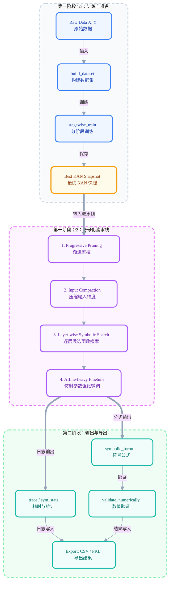

# symkan-experiments

symkan 是构建在 pykan 之上的工程化符号化工作流。它不改写 KAN 的核心表达能力，而是把训练、剪枝、符号化、评估和导出串成可复现流水线，服务论文实验、批量复现与可解释性分析。

## 目录

- [1. 项目定位](#1-项目定位)
- [2. 快速安装](#2-快速安装)
- [3. 数据准备](#3-数据准备)
- [4. 最短闭环示例](#4-最短闭环示例)
- [5. 核心流程](#5-核心流程)
- [6. 默认策略（2026-03）](#6-默认策略2026-03)
- [7. 实验口径对齐（kanipynb--docs）](#7-实验口径对齐kanipynb--docs)
- [8. 常用脚本与命令](#8-常用脚本与命令)
- [9. 包结构与公开接口](#9-包结构与公开接口)
- [10. 复现与报告规范](#10-复现与报告规范)
- [11. 常见问题](#11-常见问题)
- [12. 相关文档](#12-相关文档)

## 1. 项目定位

这个仓库解决的不是“如何重写 KAN”，而是“如何把 KAN 结果稳定推进到可验证、可导出、可批量对比的符号表达式”。

核心边界：

- 不改写 pykan 的核心实现（`kan.MultKAN`）。
- 强调工程可复现：阶段日志、trace、summary、bundle 一起落盘。
- 默认策略优先“兼容 + 吞吐 + 稳定”，而不是宣传单次 seed 的偶然峰值。

一句话：symkan 是 KAN 的工程化管控层，而不是另一套 KAN 框架。

## 2. 快速安装

推荐环境：Python 3.9（CUDA 可选）。

```bash
pip install -r requirements.txt
```

关键依赖：`torch`、`pykan`、`sympy`、`scikit-learn`、`pandas`、`matplotlib`。

快速自检：

```python
import torch
import kan
import symkan

print(torch.__version__)
print("symkan ok")
```

## 3. 数据准备

`kan.ipynb` 与 `symkanbenchmark.py` 默认优先读取：

- `X_train.npy`
- `X_test.npy`
- `Y_train_cat.npy`
- `Y_test_cat.npy`

若文件缺失，会自动按 SymbolNet 风格下载 MNIST 并生成同名 `*.npy`：

1. 优先 `tensorflow.keras.datasets.mnist`
2. 回退 `sklearn.fetch_openml("mnist_784")`

## 4. 最短闭环示例

下面示例覆盖最小可用链路：构建数据集 -> 分阶段训练 -> 符号化 -> 公式数值验证。

```python
import numpy as np
from sklearn.datasets import make_classification
from sklearn.model_selection import train_test_split

from symkan.core import build_dataset, set_device
from symkan.tuning import stagewise_train
from symkan.symbolic import LIB_HIDDEN, LIB_OUTPUT, symbolize_pipeline
from symkan.eval import validate_formula_numerically

X, y = make_classification(
    n_samples=1200,
    n_features=10,
    n_informative=6,
    n_redundant=2,
    n_classes=3,
    random_state=42,
)
X = X.astype(np.float32)
Y = np.eye(3, dtype=np.float32)[y]

X_train, X_test, Y_train, Y_test = train_test_split(
    X, Y, test_size=0.2, random_state=42, stratify=y
)

set_device("cuda")  # 无 GPU 时改为 "cpu"
dataset = build_dataset(
    X_train,
    Y_train,
    X_test,
    Y_test,
    validation_ratio=0.15,
    seed=42,
)

best_model, train_result = stagewise_train(
    dataset=dataset,
    width=[X_train.shape[1], 16, Y_train.shape[1]],
    steps_per_stage=60,
    target_edges=120,
    sym_target_edges=60,
    use_validation=True,
    adaptive_threshold=True,
    verbose=False,
)

symbolic_result = symbolize_pipeline(
    model=best_model,
    dataset=dataset,
    target_edges=90,
    max_prune_rounds=20,
    lib_hidden=LIB_HIDDEN,
    lib_output=LIB_OUTPUT,
    layerwise_finetune_steps=0,
    affine_finetune_steps=200,
    prune_adaptive_threshold=True,
    collect_timing=True,
    verbose=False,
)

print("final_acc:", symbolic_result["final_acc"])
print("final_n_edge:", symbolic_result["final_n_edge"])
print("valid_expressions:", len(symbolic_result["valid_expressions"]))

validation_df = validate_formula_numerically(
    symbolic_result["model"],
    symbolic_result["formulas"],
    dataset,
)
print(validation_df.head() if validation_df is not None else "No valid formulas")
```

## 5. 核心流程



## 6. 默认策略（2026-03）

说明：以下是“项目推荐默认”，用于论文与批量复现口径统一；它不等于所有 CLI 参数的技术默认值。

基于 `kan.ipynb` 最新产物、`benchmark_ablation/` 与 `benchmark_ab/comparison/`：

- `stagewise_train`：保持开启。
  关闭后 `final_acc` 从 `0.7807` 降到 `0.4430`，`macro_auc` 从 `0.9548` 降到 `0.8379`，入口质量坍塌。
- 渐进剪枝：保持开启。
  主要收益是复杂度与时延治理；关闭后复杂度均值 `126.90 -> 194.33`，符号化耗时 `33.58s -> 43.51s`。
- 输入压缩：默认开启。
  关闭常能改善公式验证 `R2`（`-0.6135 -> +0.0275`），但有效输入维数 `57.67 -> 120.00`，符号化耗时 `33.58s -> 41.34s`。
- 典型 2 层 KAN（`[in, hidden, class]`）：默认关闭 LayerwiseFT（`layerwise_finetune_steps=0`）。
  分类指标基本不变（`final_acc 0.7838 vs 0.7807`），但符号化耗时明显下降（`20.41s vs 33.58s`）。

一句话：默认配置优先“可复现 + 吞吐 + 兼容”，不承诺单次 seed 的偶然最高分。

## 7. 实验口径对齐（kan.ipynb + docs）

对外结论统一按以下规则表达：

1. A/B 结论（`benchmark_ab/comparison/comparison_summary.md`）
   `baseline` 的 `final_acc` 与 `macro_auc` 均值最高（`0.7807` / `0.9548`）。
   `adaptive`、`adaptive_auto` 的主要价值是流程可调与部分耗时收益，不表述为“默认精度增强”。
2. 消融结论（`benchmark_ablation/ablation_runs_summary.csv`）
   Stagewise 是可用性前提；Progressive pruning 是复杂度治理模块；Input compaction 是 R2-吞吐权衡；2 层 KAN 下 LayerwiseFT 是可选开关。
3. Notebook 速度结论（`benchmark_multi_round_summary_en.csv`、`benchmark_symbolic_parallel_quick.csv`）
   公式验证缓存后均耗 `0.1416s`，较首次验证 `0.2448s` 下降约 `42.16%`；`auto/off/thread4` 在当前规模下无稳定并行加速。

## 8. 常用脚本与命令

### 8.1 主实验脚本

```bash
python symkanbenchmark.py --tasks full --stagewise-seeds 42,52,62 --quiet
```

常见任务组合：

- `--tasks full`：主实验。
- `--tasks eval-bench`：评估链路测速。
- `--tasks parallel-bench`：并行策略对照。
- `--tasks all`：一次跑完三类任务。

### 8.2 A/B 对比（baseline/adaptive/adaptive_auto）

```bash
python benchmark_ab_compare.py \
  --root benchmark_ab \
  --baseline baseline \
  --variants adaptive,adaptive_auto \
  --output benchmark_ab/comparison
```

### 8.3 单点消融

```bash
python ablation_runner.py --stagewise-seeds 42,52,62 --global-seed 123 --quiet
```

只聚合已有结果：

```bash
python ablation_runner.py --aggregate-only --output-dir benchmark_ablation
```

LayerwiseFT 专项：

```bash
python analyze_layerwiseft.py --ablation-dir benchmark_ablation --seeds 42,52,62
python compare_layerwiseft_improved.py --ablation-dir benchmark_ablation --seeds 42,52,62 --quiet
```

## 9. 包结构与公开接口

- `symkan.core`：设备管理、数据构建、训练封装、推理与结构化类型。
- `symkan.tuning`：分阶段训练、验证集驱动剪枝、自适应阈值和选模。
- `symkan.symbolic`：函数库、输入压缩、逐层符号搜索和主流水线。
- `symkan.pruning`：容错归因入口。
- `symkan.eval`：公式数值验证和 ROC/AUC 评估。
- `symkan.io`：模型克隆、结果导出与 bundle 读写。

兼容原则：

- 公开入口优先保持向后兼容。
- 新能力以 `*_report` 结构化返回补充，不破坏旧返回值。

## 10. 复现与报告规范

建议最小复现规范：

1. 至少 3 个 seed（建议 `42,52,62`）。
2. 保留完整目录，不只保留截图或终端输出。
3. 报告必须同时包含质量、复杂度、耗时三类指标。

推荐优先引用文件：

- `benchmark_ab/comparison/comparison_summary.md`
- `benchmark_ablation/ablation_runs_summary.csv`
- `benchmark_multi_round_summary_en.csv`
- `benchmark_symbolic_parallel_quick.csv`

## 11. 常见问题

### Q1：为什么不默认打开 LayerwiseFT？

在当前典型 2 层 KAN 设定下，它的收益不稳定且耗时成本明显。默认关闭更符合收益/代价比；需要专项对照时再开启。

### Q2：为什么我的并行模式没明显加速？

当前并行只用于 `suggest_symbolic` 局部阶段，且受模型状态安全约束。小规模任务下线程调度成本可能抵消收益。

### Q3：为什么不要只看单次最高分？

单次 seed 波动容易误导，必须看多 seed 的均值与方差，尤其是 `final_acc`、`macro_auc` 与 `symbolic_total_seconds` 的联合变化。

## 12. 相关文档

- `docs/design.md`：设计动机、阶段划分和算法选型。
- `docs/symkan_usage.md`：完整使用说明与数学背景。
- `docs/symkanbenchmark_usage.md`：benchmark 工具与参数手册。
- `docs/kan_parameters.md`：`kan.ipynb` 实验参数详解。
- `docs/ablation_usage.md`：消融脚本与输出文件说明。
- `docs/ablation_report.md`：单点消融报告。
- `docs/layerwiseft_improved_report.md`：LayerwiseFT 改进实验报告。
