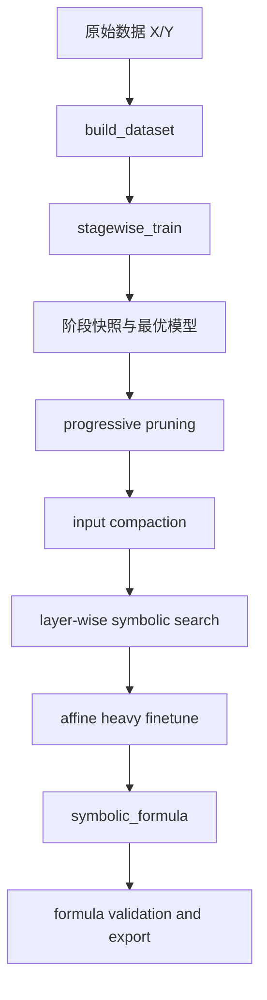

# symkan-experiments

symkan 是构建在 pykan 之上的工程化符号化工作流。它不改写 KAN 的核心表达能力，而是把训练、剪枝、符号化、评估和导出串成一条可复现的流水线，方便论文实验和批量对比。

## 快速安装

推荐环境：Python 3.9，CUDA 可选。

```bash
pip install -r requirements.txt
```

关键依赖包括：`torch`、`pykan`、`sympy`、`scikit-learn`、`pandas`、`matplotlib`。

## 快速开始

下面的例子展示最短闭环：构建数据集，分阶段训练，再执行符号化。

```python
import numpy as np
from sklearn.datasets import make_classification
from sklearn.model_selection import train_test_split

from symkan.core import build_dataset, set_device
from symkan.tuning import stagewise_train
from symkan.symbolic import LIB_HIDDEN, LIB_OUTPUT, symbolize_pipeline
from symkan.eval import validate_formula_numerically

X, y = make_classification(
	n_samples=1200,
	n_features=10,
	n_informative=6,
	n_redundant=2,
	n_classes=3,
	random_state=42,
)
X = X.astype(np.float32)
Y = np.eye(3, dtype=np.float32)[y]

X_train, X_test, Y_train, Y_test = train_test_split(
	X, Y, test_size=0.2, random_state=42, stratify=y
)

set_device("cuda")
dataset = build_dataset(
	X_train,
	Y_train,
	X_test,
	Y_test,
	validation_ratio=0.15,
	seed=42,
)

best_model, train_result = stagewise_train(
	dataset=dataset,
	width=[X_train.shape[1], 16, Y_train.shape[1]],
	steps_per_stage=60,
	target_edges=120,
	sym_target_edges=60,
	use_validation=True,
	adaptive_threshold=True,
	verbose=False,
)

symbolic_result = symbolize_pipeline(
	model=best_model,
	dataset=dataset,
	target_edges=90,
	max_prune_rounds=20,
	lib_hidden=LIB_HIDDEN,
	lib_output=LIB_OUTPUT,
	layerwise_finetune_steps=120,
	affine_finetune_steps=200,
	prune_adaptive_threshold=True,
	collect_timing=True,
	verbose=False,
)

print(symbolic_result["final_acc"])
print(symbolic_result["final_n_edge"])
print(symbolic_result["valid_expressions"])

validation_df = validate_formula_numerically(
	symbolic_result["model"],
	symbolic_result["formulas"],
	dataset,
)
print(validation_df.head() if validation_df is not None else "No valid formulas")
```

## 核心流程



## 包结构

- `symkan.core`: 设备管理、数据构建、训练封装、推理与结构化类型。
- `symkan.tuning`: 分阶段训练、验证集驱动剪枝、自适应阈值和选模。
- `symkan.symbolic`: 函数库、输入压缩、逐层符号搜索和主流水线。
- `symkan.pruning`: 容错归因入口。
- `symkan.eval`: 公式数值验证和 ROC/AUC 评估。
- `symkan.io`: 模型克隆、结果导出与 bundle 读写。

## 设计要点

- `stagewise_train` 负责把模型推到适合符号化的稀疏区间，而不是一开始就追求最终公式。
- `symbolize_pipeline` 负责把连续样条函数离散成解析式，并在每个阶段做精度保护。
- 所有公开入口优先保持向后兼容，结构化报告版本通过 `*_report` 额外提供，而不是替换旧返回值。

更完整的设计原因见 `docs/design.md`。

## 相关文档

- `docs/kan_parameters.md`: notebook 实验参数和调参顺序说明。
- `docs/symkan_usage.md`: 更完整的使用说明和实验背景。
- `docs/symkanbenchmark_usage.md`: benchmark 工具说明。
- `docs/design.md`: 设计动机、阶段划分和算法选型说明。
