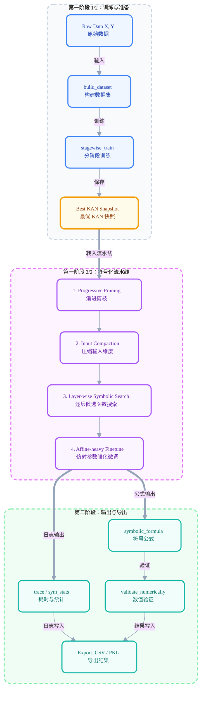

# symkan 使用文档（2026 版）

> Slogan: 把 KAN 的可表达性，变成可复现、可评估、可落地的符号化流水线。

`symkan` 是基于 `pykan` 的工程化增强层。它不替代 KAN 的核心机制，而是把“训练、剪枝、符号化、评估、导出”串成稳定流程，适用于论文实验与批量复现。

---

## 1. 项目简介

### 1.1 KAN 的数学基础

KAN（Kolmogorov-Arnold Networks，2024，Liu et al., MIT）的理论根基是 **Kolmogorov-Arnold 表示定理**：

> 任意多变量连续函数 $f: [0,1]^n \to \mathbb{R}$ 均可表示为有限个单变量连续函数的有限复合与求和：
> $$
> f(x_1, \ldots, x_n) = \sum_{q=0}^{2n} \Phi_q\!\left(\sum_{p=1}^{n} \phi_{q,p}(x_p)\right)
> $$
> 其中 $\phi_{q,p}: [0,1] \to \mathbb{R}$ 为内层单变量函数，$\Phi_q: \mathbb{R} \to \mathbb{R}$ 为外层单变量函数。

这一定理说明：**任意连续多变量函数均可分解为若干单变量函数的组合**——精确到每个节点只做求和，不做非线性变换。

### 1.2 KAN vs MLP：激活函数放在哪里？

这与传统 MLP 的设计截然不同。两者的本质差异只在一点：**非线性放哪里**。

**MLP**：权重矩阵 $W$ 可学习，激活函数 $\sigma$（如 ReLU、sigmoid）**固定在节点上**：

$$
\mathbf{h}^{(l+1)} = \sigma\!\left(W^{(l)}\mathbf{h}^{(l)} + \mathbf{b}^{(l)}\right)
$$

**KAN**：节点只做加和，激活函数本身可学习，**放置在边上**：

$$
h_j^{(l+1)} = \sum_i \phi_{ij}^{(l)}\!\left(h_i^{(l)}\right)
$$

每条边 $(i \to j)$ 上的 $\phi_{ij}$ 是**可学习的 B 样条函数**，由基底激活与样条部分线性组合而成：

$$
\phi(x) = w_b \cdot \underbrace{\frac{x}{1+e^{-x}}}_{\text{基底激活（SiLU）}} + w_s \cdot \underbrace{\sum_{k} c_k B_k(x)}_{\text{B 样条部分}}
$$

其中 $B_k(x)$ 为 B 样条基函数，$c_k$（样条系数）、$w_b$、$w_s$ 均通过反向传播学习。实践中网格点数（grid size）和样条阶数（spline order）决定了每条边的表达能力与参数量。

### 1.3 为什么 KAN 天然适合符号回归

KAN 每条边学到的是**单变量光滑函数**。训练收敛后，可以直接对每条边的激活曲线做**符号拟合**：从预定义候选库（`sin`、`x^2`、`exp`、`log`、`tanh` 等）中找出最近似的解析表达式，替换原样条参数。这种"先训练连续近似，再离散为符号"的路径，是 MLP 结构上无法原生支持的。

稀疏化是此路径的前提。若网络边数过多，符号搜索空间爆炸；先把边数压到可控范围，再逐层拟合，才能得到可读的表达式。

### 1.4 symkan 的定位

`symkan` 不重写 KAN 核心（`pykan.MultKAN`），而是在其上提供**工程化管控层**：

- 训练不稳定、收敛后结果难保留？→ `stagewise_train`：分阶段训练 + 验证集驱动 + 精度守护 + 模型快照回滚。
- 符号搜索失控、单次过剪丢失精度？→ `symbolize_pipeline`：自适应渐进剪枝 + 逐层符号化 + 强化微调。
- 实验难复现、无法批量对比？→ 全流程 CSV 日志（stage log / trace / timing）+ 统一 bundle 导出 + CLI 批量工具。

核心变换链（简化）：

$$
\underbrace{h_j^{(l+1)} = \sum_i \phi_{ij}^{(l)}(h_i^{(l)})}_{\text{KAN 前向（样条激活）}}
\;\xrightarrow{\text{稀疏化 + 符号拟合}}\;
\underbrace{h_j^{(l+1)} = \sum_i\bigl(a_{ij}\,\hat{\phi}_{ij}(h_i^{(l)}) + b_{ij}\bigr)}_{\text{符号化后（固定为解析式）}}
$$

其中 $\hat{\phi}_{ij}$ 是从候选函数库中选出并用仿射参数 $(a, b)$ 对齐的符号表达式；稀疏化后大量 $a_{ij} \approx 0$ 的边已被剪除，只保留有效连接。

---

## 2. 核心特性（Why symkan）

### 2.1 KAN + Symbolic 的工程化闭环

- `stagewise_train`：分阶段训练，支持剪枝回滚、验证集驱动、符号化就绪评分。
- `symbolize_pipeline`：渐进剪枝 + 输入压缩 + 严格逐层符号化 + 强化微调。
- `validate_formula_numerically`：对导出表达式做 R2 与数值稳定性验证。
- `save_*` 导出接口：将阶段日志、符号汇总、bundle 统一落盘。

### 2.2 与传统 MLP 对比

| 维度 | symkan (KAN + Symbolic) | 传统 MLP |
| --- | --- | --- |
| 表达形式 | 可导出显式公式（symbolic formula） | 隐式参数映射 |
| 可解释性 | 高，可做表达式级分析 | 低，依赖 post-hoc 方法 |
| 稀疏控制 | 内置边剪枝与目标边数策略 | 通常需额外正则/剪枝工具 |
| 实验复现 | 提供 stage log/trace/timing/bundle | 常需自建日志系统 |
| 适合场景 | 科学建模、符号回归、可解释分类 | 大规模黑盒预测 |

> 注意：`symkan` 不是“任何任务都优于 MLP”。如果你的目标只有纯预测精度且不关心表达式，MLP 可能更直接。
---

### 2.3 与原版 pykan（MultKAN）对比

`symkan` 是对原版 `pykan` 的**工程化封装**，不是重写。以下是两者在实际使用中的核心差异：

| 维度 | symkan | 原版 pykan（MultKAN） |
| --- | --- | --- |
| 训练调度 | 分阶段 + 精度守护 + 快照回滚 + 验证集驱动 | 单次 `model.fit()` |
| 剪枝控制 | 多轮自适应，精度跌幅守护，支持阈值退火 | 手动调用 `prune_edge` |
| 符号化流程 | 严格逐层流水线 + 微调 + 精度验证守护 | `auto_symbolic` 一键式（无精度守护） |
| 早停机制 | 内置阶段早停（精度增益 + 边数缓冲） | 无 |
| 实验可观测性 | stage log / trace / timing / sym_stats / metrics.json | 基本无结构化日志 |
| 批量复现 | CLI（`symkanbenchmark.py`）+ CSV + bundle | 依赖 Notebook 手动操作 |
| 公式数值验证 | `validate_formula_numerically`（R² + 稳定性） | 无内置验证 |
| 适合场景 | 论文批量实验、可复现对比、符号回归流水线 | 探索性实验、快速原型 |

> 使用建议：如果只是在 Notebook 里试一个想法，直接用 `pykan` 就够了。需要批量跑多 seed、追踪符号化轨迹、确保结论可复现，`symkan` 才是必要的。

## 3. 环境安装

### 3.1 Python 与依赖

推荐：`Python 3.9.x`（兼容 `>=3.9,<3.11`）

```bash
pip install -r requirements.txt
```

`requirements.txt` 关键依赖包括：`torch`, `pykan`, `sympy`, `scikit-learn`, `pandas`, `matplotlib`。

### 3.2 快速检查

```python
import torch
import kan
import symkan
print(torch.__version__)
print('symkan ok')
```

---

## 4. 快速上手（可直接运行）

下面示例包含：生成数据 -> 构建数据集 -> 分阶段训练 -> 符号化 -> 公式验证。

```python
import numpy as np
from sklearn.datasets import make_classification
from sklearn.model_selection import train_test_split

from symkan.core import set_device, build_dataset
from symkan.tuning import stagewise_train
from symkan.symbolic import symbolize_pipeline, LIB_HIDDEN, LIB_OUTPUT
from symkan.eval import validate_formula_numerically

# 1) 生成一个可复现实验数据集
X, y = make_classification(
    n_samples=2000,
    n_features=12,
    n_informative=8,
    n_redundant=2,
    n_classes=3,
    random_state=42,
)
X = X.astype(np.float32)
Y = np.eye(3, dtype=np.float32)[y]  # one-hot 标签

X_train, X_test, Y_train, Y_test = train_test_split(
    X, Y, test_size=0.2, random_state=42, stratify=y
)

# 2) 设置设备并构建 symkan 统一 dataset
set_device('cuda')  # 没有 GPU 时改为 'cpu'
dataset = build_dataset(
    X_train, Y_train, X_test, Y_test,
    validation_ratio=0.15,
    seed=42,
)

# 3) 分阶段训练（内部自动创建 KAN）
best_model, train_res = stagewise_train(
    dataset=dataset,
    width=[X_train.shape[1], 16, Y_train.shape[1]],
    steps_per_stage=60,
    target_edges=120,
    sym_target_edges=60,
    use_validation=True,
    adaptive_threshold=True,
    adaptive_lamb=True,
    adaptive_ft=True,
    verbose=False,
)

# 4) 执行符号化流水线
sym_res = symbolize_pipeline(
    model=best_model,
    dataset=dataset,
    target_edges=90,
    max_prune_rounds=25,
    lib_hidden=LIB_HIDDEN,
    lib_output=LIB_OUTPUT,
    layerwise_finetune_steps=120,
    affine_finetune_steps=200,
    prune_adaptive_threshold=True,
    collect_timing=True,
    verbose=False,
)

# 5) 读取关键结果
print('final_acc =', sym_res['final_acc'])
print('final_n_edge =', sym_res['final_n_edge'])
print('valid_expressions =', len(sym_res['valid_expressions']))

# 6) 数值验证：公式是否能逼近模型输出
val_df = validate_formula_numerically(sym_res['model'], sym_res['formulas'], dataset)
print(val_df.head() if val_df is not None else 'No valid formula')
```

> 注意：`stagewise_train` 的返回是 `(best_model, result_dict)`；`symbolize_pipeline` 的返回是结果字典，包含 `trace`、`sym_stats`、`timing` 等字段。

---

## 5. 架构深度解析（Architecture）

### 5.1 流程图（数据如何经过符号化层）



### 5.2 符号变换逻辑

在 `symbolize_pipeline` 中，每层活跃连接会调用候选函数搜索（`suggest_symbolic` 路径），随后固定为具体表达式（`fix_symbolic` 路径），并进行层间微调。

可把每层输出抽象为：

$$
h_j^{(l+1)} = \sum_i a_{ij}^{(l)}\,\phi_{ij}^{(l)}\!\left(h_i^{(l)}\right) + b_j^{(l)}
$$

- $a_{ij}^{(l)}$：连接权重（含仿射参数）
- $\phi_{ij}^{(l)}$：从函数库中选中的符号函数
- 稀疏化后只有活跃边参与求和

最终导出的公式来自 `model.symbolic_formula()`，并通过 `collect_valid_formulas` 过滤掉常数/无效表达式。

### 5.3 为什么要“先稀疏后符号化”

如果直接在高复杂度网络上做符号搜索，搜索空间会迅速爆炸。`symkan` 先把边数压到可控范围，再做分层拟合，通常更稳、更快，也更容易得到可读表达式。

---

## 6. 核心 API 参考

### 6.1 `symkan.core`

| API | 说明 | 关键参数 | 返回 |
| --- | --- | --- | --- |
| `set_device(device)` | 设置运行设备 | `cpu/cuda/auto` | `None` |
| `build_dataset(Xtr, Ytr, Xte, Yte, ...)` | 构建统一数据字典 | `validation_ratio`, `seed` | `dict` |
| `safe_fit(model, dataset, ...)` | 容错训练封装 | `steps`, `lr`, `lamb`, `update_grid` | `dict` |

数据字典字段固定为：`train_input`, `train_label`, `val_input`, `val_label`, `test_input`, `test_label`。

### 6.2 `symkan.tuning`

| API | 说明 | 关键参数 | 返回 |
| --- | --- | --- | --- |
| `stagewise_train(...)` | 分阶段训练 + 剪枝 + 选模 | `lamb_schedule`, `target_edges`, `use_validation`, `adaptive_*` | `(best_model, result_dict)` |
| `stagewise_train_report(...)` | 结构化返回版本 | 同上 | `StagewiseResult` |
| `sym_readiness_score(...)` | 精度与稀疏度折中打分 | `acc_weight`, `sym_target_edges` | `float` |

### 6.3 `symkan.pruning`

| API | 说明 | 关键参数 | 返回 |
| --- | --- | --- | --- |
| `safe_attribute(model, dataset, n_sample)` | 安全归因封装（含 inference_mode 回退） | `n_sample` | `np.ndarray` |
| `safe_attribute_report(...)` | 结构化版本 | `n_sample` | `AttributeReport` |

### 6.4 `symkan.symbolic`

| API | 说明 | 关键参数 | 返回 |
| --- | --- | --- | --- |
| `symbolize_pipeline(...)` | 主符号化流水线 | `target_edges`, `lib*`, `prune_*`, `layerwise_finetune_steps` | `dict` |
| `symbolize_pipeline_report(...)` | 结构化版本 | 同上 | `SymbolizeResult` |
| `register_custom_functions()` | 注册 `sigmoid/softplus` | 无 | `None` |

预设函数库：`LIB_HIDDEN`, `LIB_OUTPUT`, `FAST_LIB`, `EXPRESSIVE_LIB`, `FULL_LIB`。

### 6.5 `symkan.eval`

| API | 说明 | 关键参数 | 返回 |
| --- | --- | --- | --- |
| `validate_formula_numerically(...)` | 公式与模型输出一致性验证 | `n_sample` | `pd.DataFrame or None` |
| `compute_multiclass_roc_auc(y_true_onehot, y_score)` | 多分类 ROC/AUC 计算 | - | `dict` |
| `plot_roc_curves(roc_data, ...)` | ROC 曲线绘图 | `class_labels`, `title` | `None` |

### 6.6 `symkan.io`

| API | 说明 | 关键参数 | 返回 |
| --- | --- | --- | --- |
| `save_stage_logs(stage_df, csv_path)` | 保存阶段日志 | 路径 | `str` |
| `save_symbolic_summary(summary_df, csv_path)` | 保存符号汇总 | 路径 | `str` |
| `save_export_bundle(bundle, path)` | 保存实验 bundle | 路径 | `str` |
| `load_export_bundle(path)` | 读取 bundle | 路径 | `dict` |

---

## 7. 可视化示例

### 7.1 绘制多分类 ROC

```python
import numpy as np
from symkan.core import model_logits
from symkan.eval import compute_multiclass_roc_auc, plot_roc_curves

# 模型输出 logits（shape: [N, C]）
logits = model_logits(sym_res['model'], dataset['test_input'])
y_score = logits.detach().cpu().numpy()
y_true = dataset['test_label'].detach().cpu().numpy()

roc_data = compute_multiclass_roc_auc(y_true, y_score)
plot_roc_curves(roc_data, title='symkan ROC Curves')
```

### 7.2 剪枝轨迹可视化（trace）

```python
import matplotlib.pyplot as plt

trace_df = sym_res['trace']
if len(trace_df) > 0:
    fig, ax1 = plt.subplots(figsize=(8, 4))
    ax1.plot(trace_df['round'], trace_df['edges_after'], label='edges_after')
    ax1.set_xlabel('round')
    ax1.set_ylabel('edges')
    ax1.grid(alpha=0.3)

    ax2 = ax1.twinx()
    ax2.plot(trace_df['round'], trace_df['acc'], color='tab:red', label='acc')
    ax2.set_ylabel('accuracy')
    plt.title('Pruning Trace: Edge vs Accuracy')
    plt.tight_layout()
    plt.show()
```

> 注意：`trace` 是判断“过剪/空转”的第一现场证据，建议在实验报告中保留。

---

## 8. 进阶用法（Advanced Usage）

### 8.1 自定义函数库

```python
from symkan.symbolic import register_custom_functions, EXPRESSIVE_LIB

register_custom_functions()  # 注入 sigmoid / softplus
my_lib = EXPRESSIVE_LIB + ['sigmoid', 'softplus']

sym_res = symbolize_pipeline(
    best_model, dataset,
    lib=my_lib,
    weight_simple=0.10,
    verbose=False,
)
```

### 8.2 推荐调参顺序

1. 先控制剪枝节奏：`prune_threshold_start/end`, `prune_max_drop_ratio_per_round`。
2. 再看恢复能力：`finetune_steps`, `layerwise_finetune_steps`, `affine_finetune_steps`。
3. 最后扩展表达能力：从 `LIB_HIDDEN/LIB_OUTPUT` 过渡到 `FAST_LIB/EXPRESSIVE_LIB`。

### 8.3 结构化返回（dataclass）

如果你不想在脚本里使用大量字符串键，优先使用：

- `stagewise_train_report` -> `StagewiseResult`
- `symbolize_pipeline_report` -> `SymbolizeResult`
---

### 8.4 批量基准实验（symkanbenchmark.py）

`symkanbenchmark.py` 是为批量复现设计的 CLI 脚本，封装了 Notebook 主流程。目标：同一组参数批量跑多 seed、稳定导出 CSV，适合论文表格生成。

三组核心实验设计：

| 组别 | 说明 |
| --- | --- |
| `baseline` | 不启用任何 adaptive 功能，作为精度上限参考 |
| `adaptive` | 启用验证集反馈 + 自适应阈值/lamb/微调步数 |
| `adaptive_auto` | 在 `adaptive` 基础上，额外启用阶段早停与符号化自适应剪枝节奏控制 |

```bash
# baseline
python symkanbenchmark.py \
    --tasks full --stagewise-seeds 42,52,62 \
    --global-seed 123 --output-dir benchmark_ab/baseline --quiet

# adaptive
python symkanbenchmark.py \
    --tasks full --stagewise-seeds 42,52,62 \
    --global-seed 123 --output-dir benchmark_ab/adaptive \
    --use-validation --validation-ratio 0.15 \
    --adaptive-threshold --adaptive-lamb --adaptive-ft --quiet

# adaptive_auto
python symkanbenchmark.py \
    --tasks full --stagewise-seeds 42,52,62 \
    --global-seed 123 --output-dir benchmark_ab/adaptive_auto \
    --use-validation --validation-ratio 0.15 \
    --adaptive-threshold --adaptive-lamb --adaptive-ft \
    --stage-early-stop --stage-early-stop-patience 2 \
    --stage-early-stop-min-acc-gain 0.002 --stage-early-stop-edge-buffer 5 \
    --symbolic-prune-threshold-start 0.010 --symbolic-prune-threshold-end 0.030 \
    --symbolic-prune-max-drop-ratio 0.25 --symbolic-prune-threshold-backoff 0.65 \
    --symbolic-prune-adaptive-acc-drop-tol 0.025 \
    --symbolic-prune-adaptive-min-edges-gain 2 \
    --symbolic-prune-adaptive-low-gain-patience 6 --quiet
```

自动生成对比表：

```bash
python benchmark_ab_compare.py \
    --root benchmark_ab \
    --baseline baseline \
    --variants adaptive,adaptive_auto \
    --output benchmark_ab/comparison
```

输出文件说明：`variant_summary.csv`（均值统计）、`pairwise_delta_summary.csv`（胜负计数与中位数差值）、`seedwise_delta.csv`（逐 seed 差值）、`trace_summary.csv`（剪枝轨迹统计）。

**当前实验结论（3 seeds: 42/52/62）**：

- `adaptive` 和 `adaptive_auto` 相对 baseline 在 `final_acc` 均为 **1胜2负**，提升的是**流程鲁棒性**，而非精度绝对值。
- `adaptive_auto` 的 `rounds_mean = 4.33`（vs `adaptive` 的 1.0），修复了单轮过剪问题，但仍偏保守。
- 论文写作建议：同时报告均值 + 标准差 + 中位数差值 + 胜负计数，避免只报均值写结论。

### 8.5 关键 CLI 参数速查

#### stagewise 自适应参数

| CLI 参数 | 对应 Python 参数 | 说明 |
| --- | --- | --- |
| `--use-validation` | `use_validation=True` | 启用验证集驱动训练 |
| `--validation-ratio 0.15` | `validation_ratio=0.15` | 验证集占训练集比例 |
| `--adaptive-threshold` | `adaptive_threshold=True` | 自适应剪枝阈值 |
| `--adaptive-lamb` | `adaptive_lamb=True` | 自适应稀疏正则强度 |
| `--adaptive-ft` | `adaptive_ft=True` | 自适应微调步数 |
| `--stage-early-stop` | `stage_early_stop=True` | 启用阶段早停 |
| `--stage-early-stop-patience N` | `stage_early_stop_patience=N` | 连续 N 阶段无增益则停止 |
| `--stage-early-stop-min-acc-gain G` | `stage_early_stop_min_acc_gain=G` | 每阶段至少精度增益阈值 |
| `--stage-early-stop-edge-buffer B` | `stage_early_stop_edge_buffer=B` | 未达目标边数时保留 B 条 buffer |

#### symbolize 剪枝参数

| CLI 参数 | 对应 Python 参数 | 说明 |
| --- | --- | --- |
| `--symbolic-prune-threshold-start S` | `prune_threshold_start=S` | 剪枝起始阈值 |
| `--symbolic-prune-threshold-end E` | `prune_threshold_end=E` | 剪枝退火目标阈值 |
| `--symbolic-prune-max-drop-ratio R` | `prune_max_drop_ratio=R` | 单轮最大边数降幅比例（如 0.25 = 25%） |
| `--symbolic-prune-threshold-backoff B` | `prune_threshold_backoff=B` | 精度跌幅过大时阈值回退系数 |
| `--symbolic-prune-adaptive-threshold` | `prune_adaptive_threshold=True` | 自适应阈值控制（默认开启） |
| `--no-symbolic-prune-adaptive-threshold` | `prune_adaptive_threshold=False` | 显式关闭自适应阈值 |
| `--symbolic-prune-adaptive-step S` | `prune_adaptive_step=S` | 自适应阈值步进量 |
| `--symbolic-prune-adaptive-acc-drop-tol T` | `prune_adaptive_acc_drop_tol=T` | 容忍的精度跌幅上限 |
| `--symbolic-prune-adaptive-min-edges-gain G` | `prune_adaptive_min_edges_gain=G` | 最小有效边数增益 |
| `--symbolic-prune-adaptive-low-gain-patience P` | `prune_adaptive_low_gain_patience=P` | 低增益连续轮数耐心值 |

## 9. FAQ

### Q1: 为什么符号化后精度会下降？

这是稀疏化与函数离散化的自然代价。优先尝试提高 `target_edges`、`layerwise_finetune_steps`、`affine_finetune_steps`。

### Q2: 并行提速不明显正常吗？

正常。当前并行主要加速 `suggest_symbolic`，剪枝和微调仍占大量时间。

### Q3: `validate_formula_numerically` 第二次更快？

正常。内部有公式编译缓存 `_LAMBDA_CACHE`。

### Q4: 归因偶发报错怎么办？

优先使用 `safe_attribute`；它包含推理模式回退和状态恢复。

---

## 10. Roadmap（建议）

- 增加端到端 CLI 配置模板，减少参数学习成本。
- 增加符号表达式复杂度约束的自动调度策略。
- 增加跨 seed 的统计报告模板（win/lose、median delta、稳定性指数）。
- 提供更完整的 notebook 可视化模板（trace + timing + formula dashboard）。

---

## 11. 最佳实践总结

- 固定设备、随机种子与验证切分策略，先保证可复现。
- 训练与符号化分阶段保存日志（`stage_logs`, `trace`, `timing`）。
- 不只看 `final_acc`，同时报告 `final_n_edge` 与公式验证指标（R2/稳定性）。
- 批量实验建议统一导出 CSV + bundle，避免“只剩一个精度数字”。
