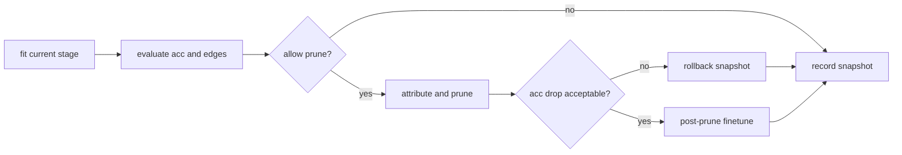

# symkan 设计文档

## 目标

symkan 要解决的不是“如何重新实现 KAN”，而是“如何把 KAN 的训练结果稳定地推进到可验证、可复现、可导出的符号表达式”。核心目标有三点：

1. 保持 pykan 的表达能力和公开行为，不破坏现有 notebook 与 benchmark 工作流。
2. 把训练、剪枝、符号化拆成边界清晰的阶段，减少一次性大流程的不可控性。
3. 为实验提供结构化输出，而不是只留下临时 print 和裸字典。

## 非目标

- 不重写 pykan 的底层 KAN 实现。
- 不把所有返回值强行升级成新类型，旧接口仍然需要可用。
- 不为了“更智能”的策略引入过重的调度系统或分布式框架。

## 核心数据结构

整个包围绕三类对象运转：

1. dataset 字典：统一使用 `train_input/train_label/val_input/val_label/test_input/test_label`。
2. KAN 模型实例：训练、剪枝和符号化都围绕同一个 pykan 模型对象展开。
3. 结构化结果对象：`FitReport`、`AttributeReport`、`StagewiseResult`、`SymbolizeResult` 用于补足旧接口的可读性和可观测性。

这里的关键判断很简单：先稳住数据结构，再谈算法。数据结构混乱时，后面的回滚、日志和导出都会变成补丁地狱。

## 为什么分成 stagewise_train 和 symbolize_pipeline

### stagewise_train 的职责

`stagewise_train` 负责把模型推到“适合符号化”的区间，而不是直接产出最终公式。原因有两个：

1. 符号化前的模型通常边数太多，直接做符号搜索会让搜索空间爆炸。
2. 稀疏化过程有明显的精度风险，必须引入阶段快照、验证集评估和回滚保护。

因此，`stagewise_train` 的流程是：

这个设计的重点不是“多阶段”三个字，而是把每轮剪枝都包进了精度守护里。否则剪枝一旦过猛，后面再精调基本是在修废墟。

### symbolize_pipeline 的职责

`symbolize_pipeline` 接管的是另一件事：把已经足够稀疏的模型变成解析式。它分成四段：

1. 渐进剪枝：继续向目标边数靠近，但每轮都有限幅和回滚保护。
2. 输入压缩：删掉第一层已经完全失活的输入，降低后续符号搜索维度。
3. 逐层符号搜索：按层 fix 边函数，避免一次性全局搜索导致状态污染。
4. 强化微调：在固定符号函数后恢复仿射参数和整体精度。

这个划分背后的原因是 pykan 的 `suggest_symbolic` 会临时修改模型状态。共享一个模型做并行 suggest 很容易出错，所以当前实现明确保守：先保证正确性，再谈并行速度。

## 关键算法选型

### 1. 为什么用 readiness score 选模

只按精度选模型是不够的，因为符号化前还需要考虑边数负担；只按边数选模型更糟，因为可能把几乎不可用的低精度模型选出来。

因此 `sym_readiness_score` 把精度和稀疏度揉进同一个分数：

$$
score = w_{acc} \cdot acc + (1 - w_{acc}) \cdot sparsity
$$

这不是理论最优，只是足够简单、可解释、可调。这里故意避免更复杂的多目标优化器，因为问题规模不值得。

### 2. 为什么要有 adaptive threshold

固定剪枝阈值的问题很直接：早期太小剪不动，后期太大又会一下子剪穿。自适应阈值控制器的作用就是根据最近几轮的收益和精度回落微调阈值，而不是硬编码一条死 schedule。

### 3. 为什么要保留旧返回值

这是最基本的兼容性要求。现有 notebook、脚本和 benchmark 已经依赖旧接口返回的 tuple 和 dict；直接改返回类型只会破坏用户空间。

所以当前做法是：

- 保留 `safe_fit`、`stagewise_train`、`symbolize_pipeline` 的旧行为。
- 额外提供 `safe_fit_report`、`safe_attribute_report`、`stagewise_train_report`、`symbolize_pipeline_report`。

这就是最实用的方案。你要新能力，可以拿 report；你要兼容旧代码，旧入口不炸。

## 行内注释策略

代码里的行内注释只放在三类位置：

1. 隐含约束：例如 `suggest_symbolic` 不能安全共享模型并行执行。
2. 容错回退：例如从 `inference_mode` 退回 `no_grad` 的原因。
3. 阶段性技巧：例如先做短微调再决定是否保留剪枝结果。

其余地方不写废话注释。变量名和函数名已经说明白的逻辑，不需要再解释一遍。

## 风险与边界

当前实现最需要警惕的点有三个：

1. pykan 内部状态不是完全无副作用，任何“共享模型并行搜索”都必须非常谨慎。
2. 环境可能缺少部分依赖，验证和运行脚本不应把导入错误伪装成算法错误。
3. 宽松的目标边数策略会影响 benchmark 公平性，因此需要明确区分默认行为和实验行为。

## 后续演进方向

1. 如果要做真正的并行符号搜索，前提是每个 worker 使用隔离模型副本。
2. 如果要提高评估质量，优先补更稳定的公式验证与异常表达式筛除。
3. 如果要继续扩展接口，优先在结构化结果对象里加字段，不要直接破坏旧返回值。
