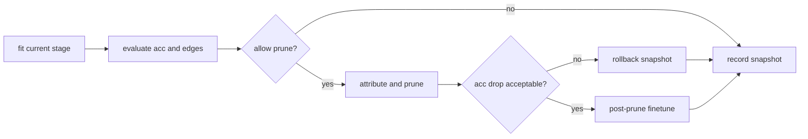

# symkan 设计文档

本文讨论系统设计的动机、边界与约束，不涉及命令级使用说明。仓库结构可参考 [project_map](project_map.md) 与 [../ARCHITECTURE.md](../ARCHITECTURE.md)。

## 文档导航

- 返回总览：[README](../README.md)
- docs 总入口：[index](index.md)
- 项目地图：[project_map](project_map.md)
- 架构总览：[../ARCHITECTURE.md](../ARCHITECTURE.md)
- 使用说明：[symkan_usage](symkan_usage.md)
- benchmark 参数与产物：[symkanbenchmark_usage](symkanbenchmark_usage.md)
- 参数细节：[kan_parameters](kan_parameters.md)
- 消融说明：[ablation_usage](ablation_usage.md)

## 工程版口径入口（2026-03）

1. 若需要“历史参考版 vs 当前工程版”的版本边界，优先阅读 [engineering_version_rerun_note.md](engineering_version_rerun_note.md)。
2. 若需要当前工程版的主引用结果与指标解释，优先阅读 [engineering_rerun_report.md](engineering_rerun_report.md)。
3. 若用于发布口径确认，请同步检查 [engineering_release_checklist.md](engineering_release_checklist.md)。
4. 本文聚焦设计原则与约束；跨版本叙述以上述工程版文档为准。

## 目录

- [目标](#目标)
- [非目标](#非目标)
- [数据结构](#数据结构)
- [stagewise_train 与 symbolize_pipeline 的分离](#stagewise_train-与-symbolize_pipeline-的分离)
- [关键算法选型](#关键算法选型)
- [行内注释策略](#行内注释策略)
- [风险与边界](#风险与边界)
- [工程化改动落地（2026-03-19）](#工程化改动落地2026-03-19)
- [实验回证后的设计收敛（2026-03）](#实验回证后的设计收敛2026-03)
- [默认设定与兼容约束](#默认设定与兼容约束)
- [后续演进方向](#后续演进方向)

## 目标

symkan 的关注点不在于重新实现 KAN，而在于将 KAN 的训练结果推进到可验证、可复现且可导出的符号表达式。其核心目标包括：

1. 保持 pykan 的表达能力和公开行为，不破坏现有 notebook 与 benchmark 工作流。
2. 把训练、剪枝、符号化拆成边界清晰的阶段，减少一次性大流程的不可控性。
3. 为实验提供结构化输出，而不是只留下临时 print 和裸字典。

## 非目标

- 不重写 pykan 的底层 KAN 实现。
- 不把所有返回值强行升级成新类型，旧接口仍然需要可用。
- 不为了“更智能”的策略引入过重的调度系统或分布式框架。

## 数据结构

整个包围绕三类对象组织：

1. dataset 字典：统一使用 `train_input/train_label/val_input/val_label/test_input/test_label`。
2. KAN 模型实例：训练、剪枝和符号化都围绕同一个 pykan 模型对象展开。
3. 结构化结果对象：`FitReport`、`AttributeReport`、`StagewiseResult`、`SymbolizeResult` 用于补足旧接口的可读性和可观测性。

这一设计首先强调数据结构的稳定性。若数据结构不统一，后续的回滚、日志记录和结果导出都将缺乏一致的组织基础。

## stagewise_train 与 symbolize_pipeline 的分离

### stagewise_train 的职责

`stagewise_train` 负责把模型推进到可符号化区间，而不是直接产出最终公式。其原因有两点：

1. 符号化前的模型通常边数太多，直接做符号搜索会让搜索空间爆炸。
2. 稀疏化过程有明显的精度风险，必须引入阶段快照、验证集评估和回滚保护。

因此，`stagewise_train` 的流程是：

这一设计的重点不在于阶段数量本身，而在于将每轮剪枝置于精度约束之下。若剪枝幅度失控，后续微调往往难以恢复有效性能。

### symbolize_pipeline 的职责

`symbolize_pipeline` 接管的是另一件事：把已经足够稀疏的模型变成解析式。它分成四段：

1. 渐进剪枝：继续向目标边数靠近，但每轮都有限幅和回滚保护。
2. 输入压缩：删掉第一层已经完全失活的输入，降低后续符号搜索维度。
3. 逐层符号搜索：按层 fix 边函数，避免一次性全局搜索导致状态污染。
4. 强化微调：在固定符号函数后恢复仿射参数和整体精度。

这一划分还与 `pykan` 中 `suggest_symbolic` 会临时修改模型状态有关。共享同一模型进行并行搜索会引入额外风险，因此当前实现优先保证正确性，再考虑并行效率。

## 关键算法选型

### 1. readiness score 的选模作用

只按精度选模型是不够的，因为符号化前还需要考虑边数负担；只按边数选模型更糟，因为可能把几乎不可用的低精度模型选出来。

因此 `sym_readiness_score` 把精度和稀疏度揉进同一个分数：

$$
score = w_{acc} \cdot acc + (1 - w_{acc}) \cdot sparsity
$$

该分数设计并不追求理论上的最优性，而是强调可解释性与可调性。考虑到当前问题规模，引入更复杂的多目标优化器并无明显必要。

### 2. adaptive threshold 的作用

固定阈值的主要问题在于其难以同时适应早期和后期阶段：阈值过小会导致剪枝不足，阈值过大则可能引起过剪。自适应阈值控制器据此根据近期收益与精度回落调整阈值。

### 3. 保留旧返回值的原因

保留旧返回值首先是兼容性要求。现有 notebook、脚本和 benchmark 已经依赖旧接口返回的 tuple 和 dict，直接修改返回类型将破坏既有工作流。

所以当前做法是：

- 保留 `stagewise_train`、`symbolize_pipeline` 的公开入口与主返回结构，避免破坏 notebook / 脚本工作流。
- `safe_fit` 默认仍兼容旧接口：失败时打印错误并返回空字典；若调用方需要严格失败边界，可使用 `raise_on_failure=True` 或直接改用 `safe_fit_report`。
- 额外提供 `safe_fit_report`、`safe_attribute_report`、`stagewise_train_report`、`symbolize_pipeline_report`。

因此，现有实现采取“保留旧接口、增补结构化报告接口”的方式。

## 行内注释策略

代码里的行内注释只放在三类位置：

1. 隐含约束：例如 `suggest_symbolic` 不能安全共享模型并行执行。
2. 容错回退：例如从 `inference_mode` 退回 `no_grad` 的原因。
3. 阶段性技巧：例如先做短微调再决定是否保留剪枝结果。

除此之外，不再增加重复性注释，以避免代码与注释之间形成冗余映射。

## 风险与边界

当前实现最需要警惕的点有五个：

1. pykan 内部状态不是完全无副作用，任何“共享模型并行搜索”都必须非常谨慎。
2. 环境可能缺少部分依赖，验证和运行脚本不应把导入错误伪装成算法错误。
3. 宽松的目标边数策略会影响 benchmark 公平性，因此需要明确区分默认行为和实验行为。
4. `load_export_bundle()` 基于 `pickle`，只能用于本地生成且来源可信的 bundle。
5. 配置中的环境变量占位符只在 YAML 解析后的标量字符串上展开，数据自动补齐默认也只允许写入仓库 `data/`，两者都属于显式安全边界而非隐式便利行为。

## 工程化改动落地（2026-03-19）

本节用于记录近期工程化改动已经改变的“设计层事实”，避免仅在用法文档中描述而在设计文档缺位。

1. 配置收敛：Notebook / CLI / 库层统一以 `AppConfig` 为配置边界，脚本层仅做小范围白名单覆盖。
2. notebook 兼容职责拆分：`symkan.config.notebook` 负责 flat kwargs 到 canonical 配置的归一化；`symkan.notebook_compat` 仅保留执行桥接职责。
3. 入口口径收敛：常规执行入口统一为 `python -m scripts.*`；`scripts/run_engineering_rerun.ps1` 作为工程复测编排入口。
4. 输出目录分层：默认运行输出为 `outputs/benchmark_*`，手册示例输出为 `outputs/rerun/*`，工程归档输出为 `outputs/rerun_v2_engine_safe_<date>/*`。
5. 跨版本指标边界：仅允许 `export_wall_time_s` 到 `symbolize_wall_time_s` 的语义映射；`run_total_wall_time_s` 是工程版新增字段，不与历史版做同名比较。
6. 文档治理约束：当入口、配置、指标或目录语义发生变化时，`README.md`、`docs/index.md`、`docs/project_map.md` 与本文必须同步更新。

## 实验结果支持下的设计收敛（2026-03）

基于 `outputs/benchmark_ablation/` 与 `outputs/benchmark_ab/comparison/` 的结果，当前若干设计决策具备成为项目层默认设定的经验依据：

1. `stagewise_train` 必须保留。
    - 去掉分阶段训练会让符号化入口过密（pre-symbolic too dense），最终精度从约 0.78 掉到约 0.44，流水线失去可用性。
2. 渐进剪枝默认保留，但它的价值主要是复杂度控制而非提精度。
    - 关闭渐进剪枝后精度变化不大，但表达式复杂度与符号化耗时明显上升。
3. 输入压缩是明确的速度-公式质量权衡开关，不是一刀切增益项。
    - 保留压缩可显著降符号化耗时；关闭压缩常能提升公式数值验证 R2，但会放大搜索维度与耗时。
4. 对典型 2 层 KAN（`[in, hidden, class]`）默认关闭层间微调。
    - 原始 LayerwiseFT 是高耗时低收益模块；改进版（早停+轻正则+短步数）虽然比旧版更稳，但综合性价比仍弱于直接关闭。
    - 理论上这是“有损符号替换 + 函数族冻结”带来的结构限制：2 层网络只有一次层间补偿窗口，难形成稳定净增益。

这些结论的意义主要在于明确模块职责：

- Stagewise 负责把模型送进可符号化区间。
- Progressive pruning 负责表达式体积治理。
- Input compaction 负责推理/导出速度治理。
- LayerwiseFT 只在明确追求极小精度增益时按需开启。

## 默认设定与兼容约束

项目层默认设定必须与现有公开行为兼容，并且可由 CLI 显式覆盖：

1. 保持现有返回值与主入口不变（兼容 notebook/脚本）。
2. 项目层设定按“稳定复现优先”排序：
    - 启用 stagewise；
    - 保留渐进剪枝；
    - 输入压缩默认开启；
    - 2 层网络默认关闭 LayerwiseFT（可通过参数开启改进版）。
3. A/B 结果用于说明这些设定的经验依据：
    - 当前统计结果中，`baseline` 在 `final_acc` 与 `macro_auc` 上均领先 `adaptive`/`adaptive_auto`。
    - `adaptive` 系列的主要价值仍是流程控制与部分耗时场景的工程可调性，不应表述为“默认精度增强”。
    - 因此项目层默认设定强调兼容性、可复现性与开关语义的明确性，而非预设其必然带来精度提升。

## 后续演进

1. 如果要做真正的并行符号搜索，前提是每个 worker 使用隔离模型副本。
2. 如果要提高评估质量，优先补更稳定的公式验证与异常表达式筛除。
3. 对输入压缩，增加“按累计归因质量保留”的保守策略，避免 Top-K 过早丢失弱相关维度。
4. 对 LayerwiseFT，只保留改进版路径（验证早停+轻正则+短步数），并继续评估是否值得长期保留。
5. 如果要继续扩展接口，优先在结构化结果对象里加字段，不要直接破坏旧返回值。
