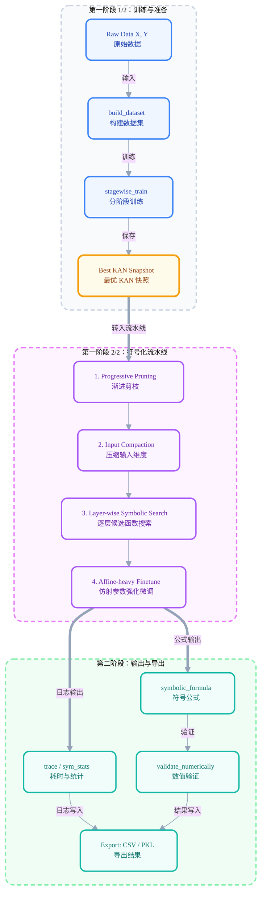

# symkan 使用文档（2026）

## 文档导航

- 返回总览：[README](../README.md)
- docs 总入口：[index](index.md)
- 项目地图：[project_map](project_map.md)
- 设计原理：[design](design.md)
- benchmark 脚本说明：[symkanbenchmark_usage](symkanbenchmark_usage.md)
- notebook 参数细节：[kan_parameters](kan_parameters.md)
- 消融实验说明：[ablation_usage](ablation_usage.md)

## 目录

- [1. 项目简介](#1-项目简介)
- [2. 方法特征](#2-方法特征)
- [3. 环境安装](#3-环境安装)
- [4. 最小示例](#4-最小示例)
- [5. 架构说明](#5-架构说明)
- [6. API 参考](#6-api-参考)
- [7. 可视化示例](#7-可视化示例)
- [8. 扩展用法](#8-扩展用法)
- [9. 补充说明](#9-补充说明)
- [10. 后续工作](#10-后续工作)
- [11. 使用要点](#11-使用要点)

如需先了解仓库结构，可参考 [project_map.md](project_map.md)。本文聚焦核心库 `symkan/` 的方法背景、接口与使用方式。

`symkan` 是构建在 `pykan` 之上的工程化封装，用于组织训练、剪枝、符号化、评估与结果导出流程，适用于批量实验与论文复现。

---

## 1. 项目简介

### 1.1 KAN 的数学基础

KAN（Kolmogorov-Arnold Networks，2024，Liu et al., MIT）的理论根基是 **Kolmogorov-Arnold 表示定理**：

> 任意多变量连续函数 $f: [0,1]^n \to \mathbb{R}$ 均可表示为有限个单变量连续函数的有限复合与求和：
> $$
> f(x_1, \ldots, x_n) = \sum_{q=0}^{2n} \Phi_q\!\left(\sum_{p=1}^{n} \phi_{q,p}(x_p)\right)
> $$
> 其中 $\phi_{q,p}: [0,1] \to \mathbb{R}$ 为内层单变量函数，$\Phi_q: \mathbb{R} \to \mathbb{R}$ 为外层单变量函数。

这一定理说明：**任意连续多变量函数均可分解为若干单变量函数的组合**——精确到每个节点只做求和，不做非线性变换。

### 1.2 KAN 与 MLP 的结构差异

KAN 与传统 MLP 的主要差异在于非线性函数的放置位置。

**MLP**：权重矩阵 $W$ 可学习，激活函数 $\sigma$（如 ReLU、sigmoid）**固定在节点上**：

$$
\mathbf{h}^{(l+1)} = \sigma\!\left(W^{(l)}\mathbf{h}^{(l)} + \mathbf{b}^{(l)}\right)
$$

**KAN**：节点只做加和，激活函数本身可学习，**放置在边上**：

$$
h_j^{(l+1)} = \sum_i \phi_{ij}^{(l)}\!\left(h_i^{(l)}\right)
$$

每条边 $(i \to j)$ 上的 $\phi_{ij}$ 是**可学习的 B 样条函数**，由基底激活与样条部分线性组合而成：

$$
\phi(x) = w_b \cdot \underbrace{\frac{x}{1+e^{-x}}}_{\text{基底激活（SiLU）}} + w_s \cdot \underbrace{\sum_{k} c_k B_k(x)}_{\text{B 样条部分}}
$$

其中 $B_k(x)$ 为 B 样条基函数，$c_k$（样条系数）、$w_b$、$w_s$ 均通过反向传播学习。实践中网格点数（grid size）和样条阶数（spline order）决定了每条边的表达能力与参数量。

### 1.3 KAN 与符号回归的关系

KAN 每条边学到的是**单变量光滑函数**。训练收敛后，可以直接对每条边的激活曲线做**符号拟合**：从预定义候选库（`sin`、`x^2`、`exp`、`log`、`tanh` 等）中找出最近似的解析表达式，替换原样条参数。这种"先训练连续近似，再离散为符号"的路径，是 MLP 结构上无法原生支持的。

稀疏化是此路径的前提。若网络边数过多，符号搜索空间爆炸；先把边数压到可控范围，再逐层拟合，才能得到可读的表达式。

### 1.4 symkan 的定位

`symkan` 不重写 KAN 核心（`pykan.MultKAN`），而是在其上提供**工程化管控层**：

- `symkan.config`：统一配置对象、YAML 加载与校验边界。
- `stagewise_train`：分阶段训练、验证集驱动选模与快照回滚。
- `symbolize_pipeline`：渐进剪枝、逐层符号化与微调。
- 导出接口：用于生成结构化日志与结果文件。

需要特别区分的是：`symkan` 是库层，提供配置、训练、符号化、评估与导出能力；benchmark / ablation 的 CLI、YAML 配置与批量复现入口属于工具层脚本，不属于 `symkan` 包 API。

核心变换链（简化）：

$$
\underbrace{h_j^{(l+1)} = \sum_i \phi_{ij}^{(l)}(h_i^{(l)})}_{\text{KAN 前向（样条激活）}}
\;\xrightarrow{\text{稀疏化 + 符号拟合}}\;
\underbrace{h_j^{(l+1)} = \sum_i\bigl(a_{ij}\,\hat{\phi}_{ij}(h_i^{(l)}) + b_{ij}\bigr)}_{\text{符号化后（固定为解析式）}}
$$

其中 $\hat{\phi}_{ij}$ 是从候选函数库中选出并用仿射参数 $(a, b)$ 对齐的符号表达式；稀疏化后大量 $a_{ij} \approx 0$ 的边已被剪除，只保留有效连接。

---

## 2. 方法特征

### 2.1 流程组织

- `stagewise_train`：分阶段训练，支持剪枝回滚、验证集驱动、符号化就绪评分。
- `symbolize_pipeline`：渐进剪枝 + 输入压缩 + 严格逐层符号化 + 强化微调。
- `validate_formula_numerically`：对导出表达式做 R2 与数值稳定性验证。
- `save_*` 导出接口：将阶段日志、符号汇总、bundle 统一落盘。

### 2.2 与传统 MLP 对比

| 维度 | symkan (KAN + Symbolic) | 传统 MLP |
| --- | --- | --- |
| 表达形式 | 可导出显式公式（symbolic formula） | 隐式参数映射 |
| 可解释性 | 高，可做表达式级分析 | 低，依赖 post-hoc 方法 |
| 稀疏控制 | 内置边剪枝与目标边数策略 | 通常需额外正则/剪枝工具 |
| 实验复现 | 提供 stage log/trace/timing/bundle | 常需自建日志系统 |
| 适合场景 | 科学建模、符号回归、可解释分类 | 大规模黑盒预测 |

需要指出的是，`symkan` 并不适用于所有任务。若研究目标仅为预测性能而不涉及表达式分析，MLP 往往是更直接的选择。
---

### 2.3 与原版 pykan（MultKAN）对比

`symkan` 是对原版 `pykan` 的**工程化封装**，不是重写。以下是两者在实际使用中的核心差异：

| 维度 | symkan | 原版 pykan（MultKAN） |
| --- | --- | --- |
| 训练调度 | 分阶段 + 精度守护 + 快照回滚 + 验证集驱动 | 单次 `model.fit()` |
| 剪枝控制 | 多轮自适应，精度跌幅守护，支持阈值退火 | 手动调用 `prune_edge` |
| 符号化流程 | 严格逐层流水线 + 微调 + 精度验证守护 | `auto_symbolic` 一键式（无精度守护） |
| 早停机制 | 内置阶段早停（精度增益 + 边数缓冲） | 无 |
| 实验可观测性 | stage log / trace / timing / sym_stats / metrics.json | 基本无结构化日志 |
| 批量复现 | CLI（`symkanbenchmark.py`）+ CSV + bundle | 依赖 Notebook 手动操作 |
| 公式数值验证 | `validate_formula_numerically`（R² + 稳定性） | 无内置验证 |
| 适合场景 | 论文批量实验、可复现对比、符号回归流水线 | 探索性实验、快速原型 |

对于探索性试验，直接使用 `pykan` 往往已经足够；对于多 seed 复现、轨迹记录和结果导出需求，`symkan` 更为合用。

### 2.4 项目层设定（2026-03）

基于 `outputs/benchmark_ablation/` 与 `outputs/benchmark_ab/comparison/` 的结果，可将参数策略区分为项目层默认设定与按目标调整的设定：

| 设计项 | 项目层设定 | 证据摘要 |
| --- | --- | --- |
| Stagewise 训练 | 必开 | 关闭后最终精度约从 0.78 跌到 0.44，符号化入口过密 |
| 渐进剪枝 | 默认开启 | 精度影响小，但显著压缩表达式复杂度与符号化耗时 |
| 输入压缩 | 默认开启（追求速度） | 关闭后公式 R² 常变好，但搜索维度和耗时明显上升 |
| LayerwiseFT（2 层 KAN） | 默认关闭（`--layerwise-finetune-steps 0`） | 旧版收益低且耗时高；改进版更稳但综合性价比仍弱于关闭 |

总体上，项目层默认设定优先考虑复现稳定性与计算成本，而非单次 seed 下的最优结果。

## 3. 环境安装

### 3.1 Python 与依赖

运行环境：`Python 3.9.x`（兼容 `>=3.9,<3.11`）

```powershell
# 运行目录：仓库根目录（symkan-experiments/）
pip install -r requirements.txt
```

`requirements.txt` 关键依赖包括：`torch`, `pykan`, `sympy`, `scikit-learn`, `pandas`, `matplotlib`。

### 3.2 环境检查

```python
import torch
import kan
import symkan
print(torch.__version__)
print('symkan ok')
```

---

## 4. 最小示例

下面示例包含：生成数据 -> 构建数据集 -> 分阶段训练 -> 符号化 -> 公式验证。

```python
import numpy as np
from sklearn.datasets import make_classification
from sklearn.model_selection import train_test_split

from symkan.config import AppConfig, StagewiseConfig, SymbolizeConfig
from symkan.core import set_device, build_dataset
from symkan.tuning import stagewise_train
from symkan.symbolic import symbolize_pipeline, LIB_HIDDEN, LIB_OUTPUT
from symkan.eval import validate_formula_numerically

# 1) 生成一个可复现实验数据集
X, y = make_classification(
    n_samples=2000,
    n_features=12,
    n_informative=8,
    n_redundant=2,
    n_classes=3,
    random_state=42,
)
X = X.astype(np.float32)
Y = np.eye(3, dtype=np.float32)[y]  # one-hot 标签；build_dataset 也接受 1D 类别索引

X_train, X_test, Y_train, Y_test = train_test_split(
    X, Y, test_size=0.2, random_state=42, stratify=y
)

# 2) 设置设备并构建 symkan 统一 dataset
set_device('cuda')  # 没有 GPU 时改为 'cpu'
dataset = build_dataset(
    X_train, Y_train, X_test, Y_test,
    validation_ratio=0.15,
    seed=42,
)

# 3) 用统一配置对象组织运行参数
app_config = AppConfig(
    stagewise=StagewiseConfig(
        width=[X_train.shape[1], 16, Y_train.shape[1]],
        steps_per_stage=60,
        target_edges=120,
        sym_target_edges=60,
        use_validation=True,
        adaptive_threshold=True,
        adaptive_lamb=True,
        adaptive_ft=True,
        verbose=False,
    ),
    symbolize=SymbolizeConfig(
        target_edges=90,
        max_prune_rounds=25,
        lib_hidden=LIB_HIDDEN,
        lib_output=LIB_OUTPUT,
        layerwise_finetune_steps=0,  # 典型 2 层 KAN 常设为 0
        affine_finetune_steps=200,
        prune_adaptive_threshold=True,
        collect_timing=True,
        verbose=False,
    ),
)

# 4) 分阶段训练 + 符号化流水线
best_model, train_res = stagewise_train(dataset=dataset, config=app_config)
sym_res = symbolize_pipeline(model=best_model, dataset=dataset, config=app_config)

# 5) 读取关键结果
print('final_acc =', sym_res['final_acc'])
print('final_n_edge =', sym_res['final_n_edge'])
print('valid_expressions =', len(sym_res['valid_expressions']))

# 6) 数值验证：公式是否能逼近模型输出
val_df = validate_formula_numerically(sym_res['model'], sym_res['formulas'], dataset)
print(val_df.head() if val_df is not None else 'No valid formula')
```

`stagewise_train` 返回 `(best_model, result_dict)`；`symbolize_pipeline` 返回结果字典，其中包含 `trace`、`sym_stats` 与 `timing` 等字段。

---

## 5. 架构说明

### 5.1 流程图（数据如何经过符号化层）



### 5.2 符号变换逻辑

在 `symbolize_pipeline` 中，每层活跃连接会调用候选函数搜索（`suggest_symbolic` 路径），随后固定为具体表达式（`fix_symbolic` 路径），并进行层间微调。

可把每层输出抽象为：

$$
h_j^{(l+1)} = \sum_i a_{ij}^{(l)}\,\phi_{ij}^{(l)}\!\left(h_i^{(l)}\right) + b_j^{(l)}
$$

- $a_{ij}^{(l)}$：连接权重（含仿射参数）
- $\phi_{ij}^{(l)}$：从函数库中选中的符号函数
- 稀疏化后只有活跃边参与求和

最终导出的公式来自 `model.symbolic_formula()`，并通过 `collect_valid_formulas` 过滤掉常数/无效表达式。

### 5.3 先稀疏后符号化

如果直接在高复杂度网络上做符号搜索，搜索空间会迅速爆炸。`symkan` 先把边数压到可控范围，再做分层拟合，通常更稳、更快，也更容易得到可读表达式。

---

## 6. API 参考

### 6.1 `symkan.config`

| API | 说明 | 关键参数 | 返回 |
| --- | --- | --- | --- |
| `load_config(path)` | 从 YAML 加载 `AppConfig` | `path` | `AppConfig` |
| `validate_app_config(values)` | 校验配置字典并返回统一配置对象 | `dict` | `AppConfig` |
| `AppConfig` | 顶层运行配置对象 | `runtime`, `data`, `stagewise`, `symbolize` 等 | 配置实例 |
| `StagewiseConfig` / `SymbolizeConfig` | 主要子配置模型 | 各阶段字段 | 配置实例 |

这一层的作用不是“给脚本凑参数”，而是统一整个项目的配置边界：

- notebook / Python 调用可直接构造 `AppConfig`
- CLI 会先 `load_config()` 得到 `AppConfig`
- 库层最终统一消费 `AppConfig`

当前还包含两个重要安全边界：

- `${ENV_VAR}` / `${ENV_VAR:-default}` 只会在 YAML 解析后的标量字符串上展开。
- 空 YAML、非法字段和越界数值会在配置加载阶段直接报错，而不是静默回退到默认值。

### 6.2 `symkan.core`

| API | 说明 | 关键参数 | 返回 |
| --- | --- | --- | --- |
| `set_device(device)` | 设置运行设备 | `cpu/cuda/auto` | `None` |
| `build_dataset(Xtr, Ytr, Xte, Yte, ...)` | 构建统一数据字典并校验标签/样本边界 | `validation_ratio`, `seed`, `device` | `dict` |
| `safe_fit(model, dataset, ...)` | 带降级与失败边界的训练封装 | `steps`, `lr`, `lamb`, `raise_on_failure` | `dict` |

数据字典字段固定为：`train_input`, `train_label`, `val_input`, `val_label`, `test_input`, `test_label`。

`build_dataset` 接受两类标签输入：

- 1D 类别索引（如 `array([0, 1, 0])`）
- 2D one-hot 或概率矩阵（如 `array([[1, 0], [0, 1], [1, 0]])`）

函数会统一把标签整理成 one-hot 形式存入 dataset，并在以下情况直接抛出明确错误：

- 标签 rank 不是 1 或 2
- 训练/测试标签类别维度不一致
- 输入样本数与标签样本数不一致

`safe_fit` 默认兼容旧接口：若训练失败，会打印错误并返回空字典；若调用方希望在失败时立即中止，可传 `raise_on_failure=True`。对需要显式区分成功、失败和降级重试的场景，优先使用 `safe_fit_report`。当前 `stagewise_train`、`symbolize_pipeline` 和逐层微调等关键路径内部都基于结构化报告处理 fit 失败，因此会回滚或中止，而不是继续沿用失败状态。

### 6.3 `symkan.tuning`

| API | 说明 | 关键参数 | 返回 |
| --- | --- | --- | --- |
| `stagewise_train(...)` | 分阶段训练 + 剪枝 + 选模 | `config=AppConfig(...)` | `(best_model, result_dict)` |
| `stagewise_train_report(...)` | 结构化返回版本 | 同上 | `StagewiseResult` |
| `sym_readiness_score(...)` | 精度与稀疏度折中打分 | `acc_weight`, `sym_target_edges` | `float` |

### 6.4 `symkan.pruning`

| API | 说明 | 关键参数 | 返回 |
| --- | --- | --- | --- |
| `safe_attribute(model, dataset, n_sample)` | 安全归因封装（含 inference_mode 回退） | `n_sample` | `np.ndarray` |
| `safe_attribute_report(...)` | 结构化版本 | `n_sample` | `AttributeReport` |

### 6.5 `symkan.symbolic`

| API | 说明 | 关键参数 | 返回 |
| --- | --- | --- | --- |
| `symbolize_pipeline(...)` | 主符号化流水线 | `config=AppConfig(...)` | `dict` |
| `symbolize_pipeline_report(...)` | 结构化版本 | 同上 | `SymbolizeResult` |
| `register_custom_functions()` | 注册 `sigmoid/softplus` | 无 | `None` |

预设函数库：`LIB_HIDDEN`, `LIB_OUTPUT`, `FAST_LIB`, `EXPRESSIVE_LIB`, `FULL_LIB`。

### 6.6 `symkan.eval`

| API | 说明 | 关键参数 | 返回 |
| --- | --- | --- | --- |
| `validate_formula_numerically(...)` | 公式与模型输出一致性验证 | `n_sample` | `pd.DataFrame or None` |
| `compute_multiclass_roc_auc(y_true_onehot, y_score)` | 多分类 ROC/AUC 计算 | - | `dict` |
| `plot_roc_curves(roc_data, ...)` | ROC 曲线绘图 | `class_labels`, `title` | `None` |

### 6.7 `symkan.io`

| API | 说明 | 关键参数 | 返回 |
| --- | --- | --- | --- |
| `save_stage_logs(stage_df, csv_path)` | 保存阶段日志 | 路径 | `str` |
| `save_symbolic_summary(summary_df, csv_path)` | 保存符号汇总 | 路径 | `str` |
| `save_export_bundle(bundle, path)` | 用 `pickle` 保存实验 bundle | 路径 | `str` |
| `load_export_bundle(path, trusted=True)` | 读取本地可信 bundle | `path`, `trusted` | `dict` |

`save_export_bundle` / `load_export_bundle` 使用 `pickle` 序列化。读取时必须显式传入 `trusted=True`，且仅应用于本地生成、来源可信的 bundle；不要直接加载下载文件、邮件附件或第三方提供的 `.pkl`。

---

## 7. 可视化示例

### 7.1 绘制多分类 ROC

```python
import numpy as np
from symkan.core import model_logits
from symkan.eval import compute_multiclass_roc_auc, plot_roc_curves

# 模型输出 logits（shape: [N, C]）
logits = model_logits(sym_res['model'], dataset['test_input'])
y_score = logits.detach().cpu().numpy()
y_true = dataset['test_label'].detach().cpu().numpy()

roc_data = compute_multiclass_roc_auc(y_true, y_score)
plot_roc_curves(roc_data, title='symkan ROC Curves')
```

### 7.2 剪枝轨迹可视化（trace）

```python
import matplotlib.pyplot as plt

trace_df = sym_res['trace']
if len(trace_df) > 0:
    fig, ax1 = plt.subplots(figsize=(8, 4))
    ax1.plot(trace_df['round'], trace_df['edges_after'], label='edges_after')
    ax1.set_xlabel('round')
    ax1.set_ylabel('edges')
    ax1.grid(alpha=0.3)

    ax2 = ax1.twinx()
    ax2.plot(trace_df['round'], trace_df['acc'], color='tab:red', label='acc')
    ax2.set_ylabel('accuracy')
    plt.title('Pruning Trace: Edge vs Accuracy')
    plt.tight_layout()
    plt.show()
```

`trace` 是判断“过剪”或“空转”的直接证据，结果报告通常需要保留该表。

---

## 8. 扩展用法

### 8.1 自定义函数库

```python
from copy import deepcopy

from symkan.symbolic import register_custom_functions, EXPRESSIVE_LIB

register_custom_functions()  # 注入 sigmoid / softplus
my_lib = EXPRESSIVE_LIB + ['sigmoid', 'softplus']

custom_config = deepcopy(app_config)
custom_config.symbolize.lib = my_lib
custom_config.symbolize.weight_simple = 0.10
custom_config.symbolize.verbose = False

sym_res = symbolize_pipeline(
    model=best_model,
    dataset=dataset,
    config=custom_config,
)
```

### 8.2 调参顺序

1. 先控制剪枝节奏：`prune_threshold_start/end`, `prune_max_drop_ratio_per_round`。
2. 再看恢复能力：`finetune_steps`, `affine_finetune_steps`，并把 `layerwise_finetune_steps` 视为可选项（2层KAN优先设为 0）。
3. 最后扩展表达能力：从 `LIB_HIDDEN/LIB_OUTPUT` 过渡到 `FAST_LIB/EXPRESSIVE_LIB`。

### 8.3 结构化返回（dataclass）

若希望减少对字符串键的直接依赖，可优先使用：

- `stagewise_train_report` -> `StagewiseResult`
- `symbolize_pipeline_report` -> `SymbolizeResult`

---

### 8.4 批量基准实验

`symkanbenchmark.py` 是面向批量复现的 CLI 脚本，封装了 Notebook 主流程，用于在同一组参数下批量运行多 seed 并稳定导出 CSV。

当前 benchmark / ablation 工具已改为优先读取 `AppConfig` YAML；脚本 CLI 只保留任务调度和一小组显式白名单覆盖。需要调整训练、剪枝或符号化细节时，优先改 `configs/*.yaml` 或直接构造 `AppConfig`。

当前配置来源口径可概括为：

- `scripts.symkanbenchmark`：显式传入 `--config` 时读取对应 YAML；省略时默认加载 `configs/symkanbenchmark.default.yaml`；随后只对白名单字段做覆盖，覆盖点分布在 `runtime / library / workflow / evaluation / symbolize`。
- `scripts.ablation_runner`：`--config` 只作为共享 `AppConfig` 透传给每次 benchmark 子运行；若省略，则各变体最终仍回退到 `configs/symkanbenchmark.default.yaml`。
- `scripts.compare_layerwiseft_improved`：当前没有独立的 `AppConfig` YAML 入口；它基于 benchmark 默认配置来源，再叠加少量 layerwise 与 `global_seed` 相关 CLI 覆盖。
- `stagewise.validation_seed` 与 `symbolize.layerwise_validation_seed` 可在 YAML 中显式给定；若留空，运行时会继承 `runtime.global_seed`。

三组核心实验设计：

| 组别 | 说明 |
| --- | --- |
| `baseline` | 不启用任何 adaptive 功能，作为精度上限参考 |
| `adaptive` | 启用验证集反馈 + 自适应阈值/lamb/微调步数 |
| `adaptive_auto` | 在 `adaptive` 基础上，额外启用阶段早停与符号化自适应剪枝节奏控制 |

```powershell
# 运行目录：仓库根目录（symkan-experiments/）
# baseline
python -m scripts.symkanbenchmark `
    --tasks full --stagewise-seeds 42,52,62 `
    --config configs/benchmark_ab/baseline.yaml `
    --output-dir outputs/benchmark_ab/baseline --quiet

# adaptive
python -m scripts.symkanbenchmark `
    --tasks full --stagewise-seeds 42,52,62 `
    --config configs/benchmark_ab/adaptive.yaml `
    --output-dir outputs/benchmark_ab/adaptive --quiet

# adaptive_auto
python -m scripts.symkanbenchmark `
    --tasks full --stagewise-seeds 42,52,62 `
    --config configs/benchmark_ab/adaptive_auto.yaml `
    --output-dir outputs/benchmark_ab/adaptive_auto --quiet
```

仓库现在已提供 `configs/benchmark_ab/baseline.yaml`、`configs/benchmark_ab/adaptive.yaml` 与 `configs/benchmark_ab/adaptive_auto.yaml` 三份模板。若需扩展，可从它们继续复制并调整 `stagewise.*` / `symbolize.*` 字段。不要把三个变体都指向同一份 YAML，否则只会得到“不同目录、相同配置”的伪对照。

自动生成对比表：

```powershell
# 运行目录：仓库根目录（symkan-experiments/）
python -m scripts.benchmark_ab_compare `
    --root outputs/benchmark_ab `
    --baseline baseline `
    --variants adaptive,adaptive_auto `
    --output outputs/benchmark_ab/comparison
```

输出文件说明：`variant_summary.csv`（均值统计）、`pairwise_delta_summary.csv`（胜负计数与中位数差值）、`seedwise_delta.csv`（逐 seed 差值）、`trace_summary.csv`（剪枝轨迹统计）、`comparison_summary.md`（便于论文或汇报复用的摘要）。

当前 3 个 seeds（42/52/62）上的结果如下：

- `baseline` 在 `final_acc` 与 `macro_auc` 上均高于 `adaptive` 与 `adaptive_auto`。
- `adaptive` 在 `final_acc` 上对 baseline 为 **1胜2负**；`adaptive_auto` 为 **0胜3负**，不支持“精度增强”表述。
- `adaptive_auto` 的 `rounds_mean = 3.67`（vs `adaptive` 的 1.0），说明它在剪枝节奏控制上优于 `adaptive`，但未转化为稳定精度收益。
- 结果报告宜同时给出均值、标准差、中位数差值与胜负计数。

### 8.5 LayerwiseFT 改进版

如需启用 LayerwiseFT，可采用带早停和轻正则的短步数设置，而非旧版的长步数无约束微调。这里要区分两种口径：

- 技术默认值：`configs/*.yaml` / schema 当前保留 `layerwise_finetune_steps=60` 与验证集早停参数，便于对照实验复现。
- 项目推荐基线：对典型 2 层 KAN，通常显式传入 `--layerwise-finetune-steps 0`，把 LayerwiseFT 视为按需开启的实验开关。

- 参考起点：`--layerwise-finetune-steps 60 --layerwise-use-validation --layerwise-finetune-lamb 1e-5 --layerwise-early-stop-patience 2`
- 适用场景：你愿意用更多时间换取极小的分类指标提升。
- 不适用场景：批量跑 seed、追求最低方差、追求最快导出（这时优先 `--layerwise-finetune-steps 0`）。

已有对比结论（3 seeds）可概括为：

- 改进版相对当前 full（两者默认参数已对齐）：分类与结构指标几乎不变，仅有轻微时间收益（~0.3s 级别）。
- 改进版相对关闭 LayerwiseFT：收益极小，但耗时增加明显，且公式 R² 更差。

理论解释如下：

- 逐层符号化本质是有损替换，`fix_symbolic` 确定函数族后不能回退重选。
- 对 2 层 KAN，LayerwiseFT 只有一次层间补偿窗口，优化自由度受限。
- 改进版（早停 + 轻正则 + 60 步）主要是降低旧版长步数无约束微调的副作用，不等于稳定创造净收益。

因此，LayerwiseFT 更接近可选实验开关，而非常规默认设置。

### 8.6 关键 CLI 参数

#### stagewise 自适应参数

| CLI 参数 | 对应 Python 参数 | 说明 |
| --- | --- | --- |
| `--device cpu` | `runtime.device="cpu"` | 覆盖运行设备 |
| `--global-seed 123` | `runtime.global_seed=123` | 覆盖全局随机种子 |
| `--baseline-seed 123` | `runtime.baseline_seed=123` | 覆盖基线模型随机种子 |
| `--batch-size 256` | `runtime.batch_size=256` | 覆盖训练批大小 |
| `--lib-preset fast` | `library.lib_preset="fast"` | 覆盖函数库预设 |

#### symbolize 剪枝参数

| CLI 参数 | 对应 Python 参数 | 说明 |
| --- | --- | --- |
| `--max-prune-rounds 12` | `symbolize.max_prune_rounds=12` | 覆盖符号化最大剪枝轮数 |
| `--no-input-compaction` | `symbolize.enable_input_compaction=False` | 关闭输入压缩 |
| `--prune-collapse-floor 0.0` | `symbolize.prune_collapse_floor=0.0` | 调整或关闭崩塌保护 |
| `--symbolic-prune-adaptive-acc-drop-tol 0.025` | `symbolize.prune_adaptive_acc_drop_tol=0.025` | 覆盖自适应精度跌幅容忍度 |

#### layerwise 微调参数

| CLI 参数 | 对应 Python 参数 | 说明 |
| --- | --- | --- |
| `--layerwise-finetune-steps 0` | `symbolize.layerwise_finetune_steps=0` | 关闭或缩短 layerwise 微调 |
| 更细的 layerwise 参数 | `symbolize.*` | 如 `layerwise_finetune_lr`、`layerwise_use_validation`、`layerwise_early_stop_*` 建议直接写入 `AppConfig` YAML；CLI 仅保留少量白名单覆盖 |

## 9. 补充说明

### 9.1 符号化后的精度变化

符号化后的精度下降通常源于稀疏化与函数离散化带来的逼近误差。若需补偿，可优先调整 `target_edges` 与 `affine_finetune_steps`。对于 2 层 KAN，不宜直接增大 `layerwise_finetune_steps` 而缺乏验证。

### 9.2 并行加速的边界

当前并行主要作用于 `suggest_symbolic` 阶段，因此总体加速幅度受限于剪枝与微调阶段的耗时占比。

### 9.3 公式验证的缓存效应

`validate_formula_numerically` 的后续调用通常快于首次调用，原因在于内部存在公式编译缓存 `_LAMBDA_CACHE`。

### 9.4 归因阶段的异常处理

归因阶段若出现偶发异常，可优先使用 `safe_attribute`，该接口包含推理模式回退与状态恢复逻辑。

---

## 10. 后续工作

- 增加端到端 CLI 配置模板，减少参数学习成本。
- 增加符号表达式复杂度约束的自动调度策略。
- 增加跨 seed 的统计报告模板（win/lose、median delta、稳定性指数）。
- 提供更完整的 notebook 可视化模板（trace + timing + formula dashboard）。

---

## 11. 使用要点

- 固定设备、随机种子与验证切分策略，先保证可复现。
- 训练与符号化分阶段保存日志（`stage_logs`, `trace`, `timing`）。
- 不只看 `final_acc`，同时报告 `final_n_edge` 与公式验证指标（R2/稳定性）。
- 批量实验宜统一导出 CSV + bundle，避免结果仅保留单一精度指标。
